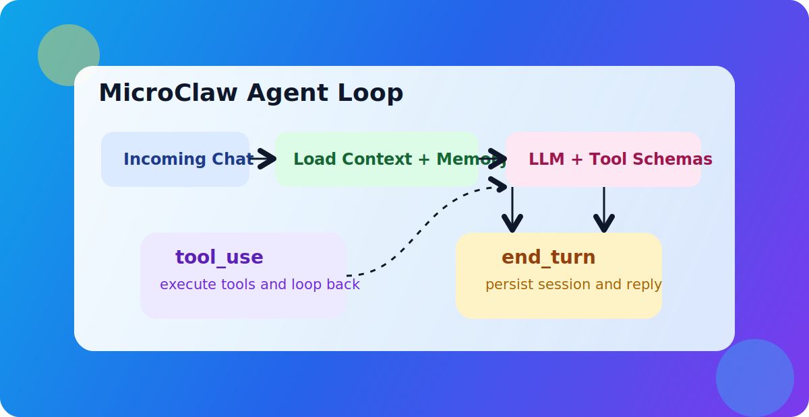

## <a id="ch4"></a>第4章 Agent Loop 深潜：状态机、事件流与可恢复性

### <a id="ch4-1"></a>4.1 stop_reason 驱动的状态转移

MicroClaw 的 Agent Loop 可以视为一个由 `stop_reason` 驱动的有限状态机。核心状态并不多，但边界定义明确。

主要状态可抽象为：

1. `LLM_CALLING`：向模型请求下一步。
2. `TOOL_EXECUTING`：执行模型请求的工具。
3. `FINALIZING`：收敛输出并持久化会话。
4. `ABORTED`：被策略阻断或达到上限后终止。

`stop_reason` 是状态机的转移条件：

1. `tool_use`：从 `LLM_CALLING` 转入 `TOOL_EXECUTING`。
2. `end_turn`：从 `LLM_CALLING` 进入 `FINALIZING`。
3. `max_tokens`：进入受限 `FINALIZING`，并可能触发提示性收尾。
4. 其他值：走未知分支兜底，仍尝试进入 `FINALIZING`。

这种显式转移的好处是：

1. 每一轮都有边界，循环不会凭直觉推进。
2. 错误分支可单独观测和测试。
3. 新增 stop_reason 或 provider 行为变化时，可定位影响面。

在多 provider 场景下，这种状态机设计尤其重要。不同模型厂商对 `stop_reason` 的细节约定可能不同，统一状态转移层可以消化兼容差异，避免业务逻辑散落在 provider 适配代码中。

### <a id="ch4-2"></a>4.2 流式输出与事件总线

Agent Loop 不仅产生最终文本，还会产生过程事件。`AgentEvent` 结构显示系统把执行过程拆成可流式消费的事件流：迭代开始、工具开始、工具结果、文本增量、最终响应。

这种设计带来三个直接收益：

1. UI 体验：前端可实时显示“第几轮、在跑什么工具、工具是否报错”。
2. 诊断能力：出问题时不用猜，能看到故障落点。
3. 扩展可能：未来可把事件流接入审计或智能回放系统。

事件模型本质上是“把内部状态公开为稳定接口”。只要事件契约稳定，展示层和控制层就可以独立演进。比如 Web 端可以做 timeline，命令行可以做简化进度条，二者不需要修改 Agent Loop 的核心流程。

另一个细节是流式 delta 的转发逻辑。系统在流式模式下将模型文本增量转发到统一事件通道，而非直接耦合具体 UI。这个隔离让“输出机制”与“展示机制”解耦，有利于后续接入更多客户端。

### <a id="ch4-3"></a>4.3 最大迭代上限与反失控设计

Agent 系统最常见的生产事故之一是“循环失控”：模型持续调用工具却无法收敛。MicroClaw 通过多层约束降低该风险。

第一层是硬上限：`max_tool_iterations`。达到上限即收口，避免资源持续消耗。

第二层是语义收口：达到上限后系统会补一条 assistant 消息，明确说明因迭代上限中止，并建议用户拆分任务。这个动作不仅是用户提示，更是协议稳定措施，确保会话可继续恢复。

第三层是失败反馈：`failed_tools` 集合把本轮失败工具名汇总到最终响应中，让用户知道“任务没完全成功”的具体原因。

第四层是空回复防护：可见内容为空时自动注入 guard 并重试一次，减少“模型看似回答了，用户却什么也没看到”的体验故障。

这些设计共同体现一个思想：系统不追求“永不失败”，而追求“可控失败、可恢复失败、可解释失败”。

### <a id="ch4-4"></a>4.4 会话持久化与跨轮次连续执行

MicroClaw 的可恢复性建立在“每轮落盘”而非“最终落盘”思路上。关键路径包括：

1. 每次得到可持久化 assistant 内容后写入 session。
2. 恢复时优先加载 session，再补齐新用户消息。
3. session 不可用时回退到数据库历史。

这套机制解决了两个现实问题：

1. 进程重启后不丢执行上下文。
2. 适配器短时故障不会导致对话完全断层。

此外，系统会在会话持久化前剥离图像块等非必要重量数据，避免 session 膨胀过快。这体现了“可恢复性”和“成本控制”之间的平衡。

从产品视角看，可恢复性直接决定用户信任。用户在第 10 轮交给 agent 的任务，如果第 11 轮因为重启而归零，任何“智能”都失去价值。MicroClaw 把会话恢复放进核心路径，正是基于这个判断。

### <a id="ch4-5"></a>4.5 本章小结

本章把 Agent Loop 从“流程描述”升级为“状态机理解”：状态转移由 `stop_reason` 驱动，事件流暴露过程信息，边界保护限制失控，会话持久化支撑连续执行。

下一章将切换到工具系统，解释 Agent Loop 如何通过统一工具抽象连接真实世界动作，并保持扩展能力与策略一致性。

### 源码片段与图示

#### 图示：通用 Agent Loop 结构



#### 源码片段：事件流定义（节选，`src/agent_engine.rs`）

```rust
#[derive(Debug, Clone)]
pub enum AgentEvent {
    Iteration { iteration: usize },
    ToolStart { name: String },
    ToolResult {
        name: String,
        is_error: bool,
        preview: String,
        duration_ms: u128,
        status_code: Option<i32>,
        bytes: usize,
        error_type: Option<String>,
    },
    TextDelta { delta: String },
    FinalResponse { text: String },
}
```

#### 源码片段：达到迭代上限后的收口（节选）

```rust
let max_iter_msg = "I reached the maximum number of tool iterations...".to_string();
messages.push(Message {
    role: "assistant".into(),
    content: MessageContent::Text(max_iter_msg.clone()),
});
if let Ok(json) = serde_json::to_string(&messages) {
    let _ = call_blocking(state.db.clone(), move |db| db.save_session(chat_id, &json)).await;
}
```
