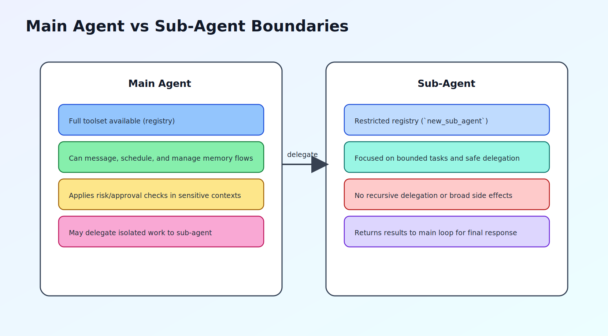

## <a id="ch5"></a>第5章 工具系统设计：统一抽象与可扩展执行

### <a id="ch5-1"></a>5.1 Tool Trait 与注册中心

MicroClaw 的工具系统从一个简单接口出发：每个工具都实现统一 `Tool` trait，至少包含名称、定义（JSON Schema）和执行函数。这个抽象看似普通，但它把“能力声明”和“执行实现”绑定在同一对象上，使模型可调用性与运行时可执行性保持一致。

在注册层，`ToolRegistry` 负责三件事：

1. 构建工具实例与依赖注入。
2. 缓存工具定义，供模型端声明工具集。
3. 执行时分发到具体工具并补全结果元信息。

结果元信息（如 `duration_ms`、`bytes`、`status_code`、`error_type`）不是锦上添花，而是诊断基线。没有这些字段，就难以在运维上区分“工具慢”“工具错”“工具被策略拦截”三类问题。

### <a id="ch5-2"></a>5.2 内建工具分类与边界

根据当前代码与生成文档，内建工具约 29 个，可按职责分为六组：

1. 执行与文件组：`bash`、`read_file`、`write_file`、`edit_file`、`glob`、`grep`。
2. 记忆组：`read_memory`、`write_memory`、`structured_memory_*`。
3. 外部信息组：`web_search`、`web_fetch`、`browser`。
4. 协作组：`send_message`、`export_chat`。
5. 调度组：`schedule_task`、`list/pause/resume/cancel/get_task_history`、DLQ 相关。
6. 编排与扩展组：`todo_read`、`todo_write`、`activate_skill`、`sync_skills`、`sub_agent`。

这套分组反映了一个重要设计原则：让工具名直接表达意图边界。比如 `structured_memory_delete` 明确是结构化层操作，不与文件记忆混用；`sub_agent` 明确是委派语义，不与普通工具执行混淆。

命名清晰带来的收益是“模型更容易选对工具，开发者更容易排错”。在 Agent 系统里，这一点通常比单纯增加工具数量更重要。

### <a id="ch5-3"></a>5.3 子代理工具集裁剪

`sub_agent` 是 MicroClaw 的一个关键能力：把某些子任务交给受限工具集并行处理。代码中的 `ToolRegistry::new_sub_agent` 明确去掉了高副作用工具，如 `send_message`、`write_memory`、调度与导出等。

这种裁剪有三层意义：

1. 权限最小化：子代理只能做分析和局部执行，不直接操作外部沟通面。
2. 递归防失控：子代理不能再调用 `sub_agent`，避免无限分叉。
3. 结果可控：子代理输出最终仍回到主代理，由主代理决定如何对用户呈现。

并行子代理经常被误用为“让系统更聪明”的捷径。正确用法应是“让系统更可分工”：把独立子问题切出去，但保留主流程的一致约束。

### <a id="ch5-4"></a>5.4 工具开发模板与质量门禁

一个新工具从概念到落地，至少应经过以下步骤：

1. 定义名称与输入 JSON Schema。
2. 实现执行逻辑，保证返回统一 `ToolResult`。
3. 在注册中心接入并注入所需依赖。
4. 标定风险等级与执行策略。
5. 编写单元测试与最小集成验证。
6. 更新生成文档，避免文档漂移。

其中第四步非常关键。很多项目把风险策略写在文档里而不是运行时里，最终策略失效。MicroClaw 的做法是把策略校验放到 `execute_with_auth` 主路径，确保所有工具调用都会经过同一检查。

工具质量门禁应关注四类失败：

1. 参数缺失或类型错误。
2. 权限不足（跨 chat 操作、非 control chat）。
3. 策略拦截（execution policy / approval）。
4. 运行时异常（超时、IO、外部依赖失败）。

只有这四类失败可区分，Agent 才能在回复中给出正确后续动作（重试、改参数、申请权限、人工介入）。

### <a id="ch5-5"></a>5.5 本章小结

本章说明了工具系统为何是 Agent runtime 的“执行关节”：统一接口让能力可声明、可执行、可治理；注册中心让策略与观测集中生效；子代理裁剪让并行能力不失控。

下一章进入安全机制，详细讨论风险分级、审批门和授权模型如何在工具路径上形成多层防护。

### 源码片段与图示

#### 图示：主代理与子代理边界



#### 源码片段：工具策略入口（节选，`src/tools/mod.rs`）

```rust
pub async fn execute_with_auth(
    &self,
    name: &str,
    input: serde_json::Value,
    auth: &ToolAuthContext,
) -> ToolResult {
    if let Err(msg) =
        validate_execution_policy(name, self.sandbox_mode, self.sandbox_runtime_available)
    {
        return ToolResult::error(msg).with_error_type("execution_policy_blocked");
    }
    if let Some(blocked) = require_high_risk_approval(name, auth) {
        return blocked;
    }
    let input = inject_auth_context(input, auth);
    self.execute(name, input).await
}
```

#### 源码片段：子代理受限工具集（节选，`src/tools/sub_agent.rs`）

```rust
let tools = ToolRegistry::new_sub_agent(&self.config, self.db.clone());
// new_sub_agent 不包含 send_message/write_memory/schedule/sub_agent
let tool_defs = tools.definitions().to_vec();
```
