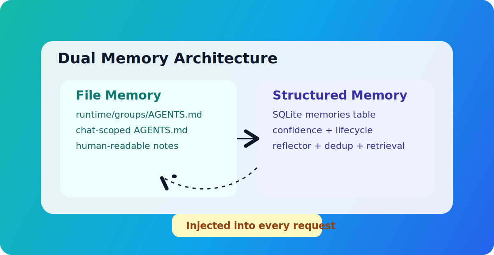
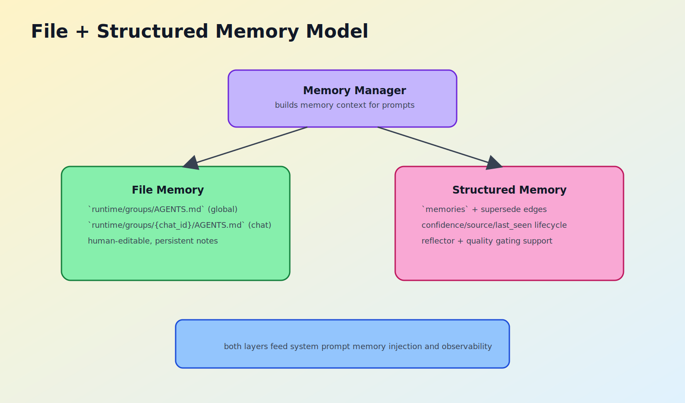

## <a id="ch8"></a>第8章 记忆系统：文件记忆 + 结构化记忆的分层模型

本章导读：本章围绕该主题展开，先交代问题背景，再说明实现与取舍，最后给出实践建议。

### <a id="ch8-1"></a>8.1 AGENTS.md 持久化记忆

MicroClaw 的记忆设计不是单存储方案，而是双层模型。第一层是文件记忆：`AGENTS.md`。它分为全局和每聊天两个作用域，读取直观、编辑简单、可被人直接审阅。

文件记忆层的价值主要有三点：

1. 可读性高：人类可以直接打开查看。
2. 可移植性强：迁移或备份成本低。
3. 可解释性好：用户能明确知道“系统记住了什么”。

但仅有文件记忆并不足以支撑大规模长期任务，因为它在检索效率、冲突管理、生命周期管理上存在天然局限。这也是结构化记忆层出现的原因。

### <a id="ch8-2"></a>8.2 SQLite 结构化记忆与生命周期

结构化记忆存储在数据库 `memories` 表，并伴随类别、来源、置信度、归档状态等元数据。相比纯文本记忆，它支持更细粒度的治理。

关键能力包括：

1. 分类存储：PROFILE、KNOWLEDGE、EVENT。
2. 置信度管理：支持不同来源的可信度区分。
3. 替换链路：通过 supersede 关系管理“旧事实被新事实覆盖”。
4. 生命周期：支持软归档而非简单硬删除。

这种结构允许系统回答更复杂问题：

1. 这条记忆是谁、何时、基于什么写入的？
2. 这条事实是否已过时并被替换？
3. 当前注入给模型的是活动记忆还是低置信度记忆？

也就是说，结构化层把“记住”变成“可治理的长期知识状态”。

### <a id="ch8-3"></a>8.3 Reflector 提取与记忆质量闸门

MicroClaw 通过后台 Reflector 周期性从对话中提取长期事实。它不是简单摘要器，而是带规则约束的提取器。

提取规则强调：

1. 只抽取耐久事实，不记闲聊。
2. 输出结构化 JSON，便于后处理。
3. 对冲突事实可标记 supersedes_id。
4. 控制每条内容长度和具体性。

更重要的是记忆污染防护。代码里显式避免把“错误行为描述”写成永久事实，例如“工具调用坏了”这类描述可能反向污染后续行为。系统更鼓励把问题写成纠正型 action item（例如 TODO: ensure ...）。

这是一种很实用的经验：长期记忆不应存放“故障复述”，应存放“行为准则”。否则模型读取后可能强化错误模式。

### <a id="ch8-4"></a>8.4 语义检索与 token 预算注入

记忆最终价值体现在“注入阶段”。MicroClaw 在构建系统提示词时，会根据当前 query 选择相关记忆，并受 `memory_token_budget` 限制。

注入策略分两档：

1. 语义检索（启用 `sqlite-vec` + embedding 时）。
2. 关键词/相关度排序（默认回退路径）。

无论哪种路径，系统都遵循预算上限并记录注入日志（候选数量、选中数量、省略数量、估算 token）。这为调优提供了事实依据。

常见调优实践：

1. 若答非所问：检查 query 截断长度与相关度排序。
2. 若遗忘关键事实：提高 `memory_token_budget` 或改进记忆内容颗粒度。
3. 若注入过重：降低预算并增强分类过滤规则。

记忆注入本质上是检索系统，不是文件拼接。只有可检索、可预算、可观测，记忆才能在长期任务里稳定发挥价值。

### <a id="ch8-5"></a>8.5 本章小结

MicroClaw 的记忆系统用“文件层 + 结构化层 + 反思层 + 注入层”形成闭环：可读、可管、可提取、可利用。

下一章将讨论 Todo 编排机制，说明系统如何把“多步骤任务”从口头计划变成可追踪执行。

### 源码片段与图示

#### 图示：记忆架构





#### 源码片段：结构化记忆注入（节选，`src/agent_engine.rs`）

```rust
let db_memory = build_db_memory_context(
    &state.db,
    &state.embedding,
    chat_id,
    &query,
    state.config.memory_token_budget,
)
.await;
let memory_context = format!("{}{}", file_memory, db_memory);
```

#### 源码片段：记忆污染防护（节选，`src/scheduler.rs`）

```rust
fn should_skip_memory_poisoning_risk(content: &str) -> bool {
    looks_like_broken_behavior_fact(content) && !is_corrective_action_item(content)
}
```

### 实践误区速览

1. 把记忆系统当作“长期上下文缓存”，忽视质量闸门。
2. todo 状态与真实执行脱节，导致计划可见但不可用。
3. 只做任务调度，不做失败队列和恢复路径设计。
