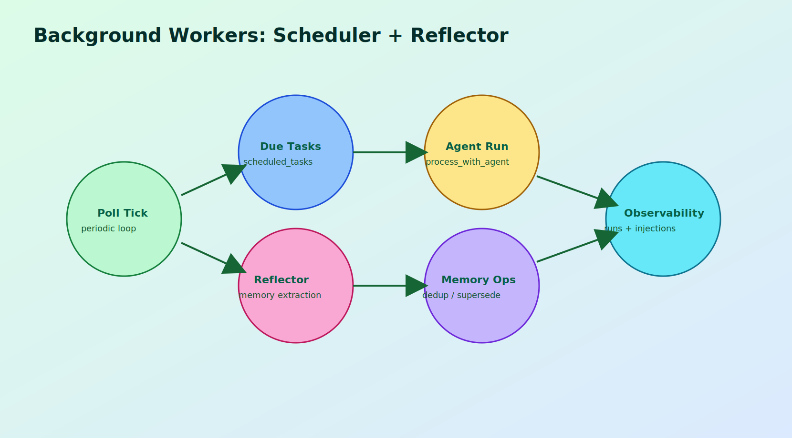
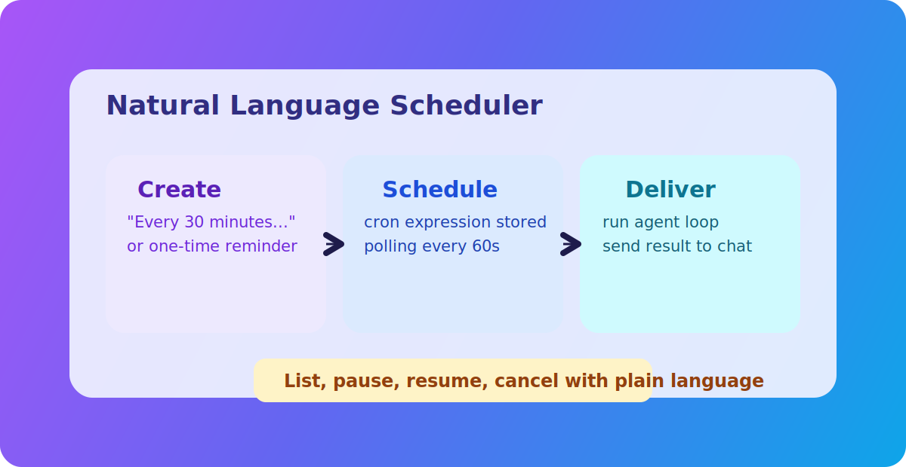

## <a id="ch10"></a>第10章 定时任务系统：从一次性触发到持续自动化

本章导读：本章围绕该主题展开，先交代问题背景，再说明实现与取舍，最后给出实践建议。

### <a id="ch10-1"></a>10.1 调度模型与 Cron 约定

MicroClaw 的调度能力由一组工具接口和后台循环共同完成。前台通过 `schedule_task` 等工具声明任务，后台 scheduler 每分钟轮询到期任务并触发执行。

系统支持两类计划：

1. `once`：一次性执行，使用 ISO 时间戳。
2. `cron`：周期执行，采用 6 字段（含秒）格式。

这个 6 字段约定是一个工程细节。很多用户习惯 5 字段 cron，系统建议自动补秒字段，既兼容习惯又保持内部统一。

任务数据会持久化记录 `next_run`、最后运行状态、历史执行摘要等信息，为后续审计与恢复提供基础。

### <a id="ch10-2"></a>10.2 Scheduler 与 Agent Loop 的耦合点

Scheduler 并不实现另一套智能体逻辑，而是复用同一个 `process_with_agent`。它只是把任务 prompt 作为 override 注入，让 Agent Loop 以“定时任务来源”身份执行。

这种复用有三个优势：

1. 行为一致：人工触发和定时触发共享同一执行语义。
2. 维护成本低：Bug 修复一次即可覆盖两类入口。
3. 安全策略一致：工具审批、权限、hooks、策略全部复用。

执行完成后，scheduler 会把结果送回对应 chat，并写入运行日志。失败时也会写日志并推送错误消息，让用户知道自动化链路出错而不是沉默失效。

这表明定时系统不是“后台静默脚本”，而是“有反馈的代理执行入口”。

### <a id="ch10-3"></a>10.3 DLQ 与任务恢复机制

自动化系统不可避免会失败。关键不是杜绝失败，而是有可恢复机制。MicroClaw 在任务失败时会写入 DLQ（dead letter queue）记录，并提供查询和重放工具：

1. `list_scheduled_task_dlq`：查看失败任务。
2. `replay_scheduled_task_dlq`：按 chat 或 task 维度重放。

重放策略通常包括：

1. 重新入队并设置立即执行。
2. 在 DLQ 记录标记 replayed 状态和注记。
3. 可限制批量重放上限，避免雪崩。

该机制把“失败任务”从终点变成中间态。配合 runbook 中的 SLO 告警（如 scheduler recoverability），团队可以把自动化可靠性纳入日常运维指标，而非出问题后临时排查。

### <a id="ch10-4"></a>10.4 本章小结

定时任务系统的核心价值在于：把 Agent 从“被动响应”升级为“主动执行”，同时保留完整的失败记录和恢复路径。

下一章将转向多渠道适配，讨论统一核心如何落地到不同平台约束下的输入输出行为。

### 源码片段与图示

#### 图示：调度任务生命周期





#### 源码片段：调度器复用 Agent Loop（节选，`src/scheduler.rs`）

```rust
let (success, result_summary) = match process_with_agent(
    state,
    AgentRequestContext {
        caller_channel: &routing.channel_name,
        chat_id: task.chat_id,
        chat_type: routing.conversation.as_agent_chat_type(),
    },
    Some(&task.prompt),
    None,
)
.await
{
    Ok(response) => (true, Some(response)),
    Err(e) => (false, Some(format!("Error: {e}"))),
};
```
