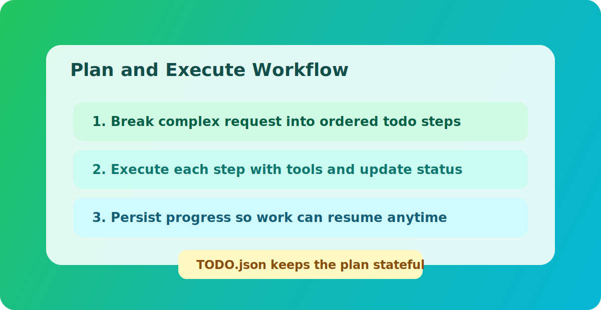

## <a id="ch18"></a>第18章 Agent Loop 案例工坊：30 个任务如何收敛

本章导读：本章围绕该主题展开，先交代问题背景，再说明实现与取舍，最后给出实践建议。

### <a id="ch18-1"></a>18.1 使用说明

本章给出 30 个典型任务案例。每个案例都按同一模板组织：

1. 用户目标。
2. 建议循环路径。
3. 关键工具调用。
4. 常见失败点与修复策略。

这组案例的目的不是提供固定答案，而是提供“可复用执行骨架”。

### <a id="ch18-2"></a>18.2 案例集

#### 案例1：仓库超时配置普查

- 目标：找出所有 timeout 配置并汇总。
- 路径：todo -> glob -> grep -> read_file -> 汇总。
- 失败点：grep 结果过大。
- 修复：先按目录分批检索，逐批汇总。

#### 案例2：生成发布说明草稿

- 目标：根据最近提交生成 release notes。
- 路径：bash(git log) -> 分类 -> 输出。
- 失败点：提交跨度过大。
- 修复：限定时间窗口或版本 tag。

#### 案例3：定位某错误日志根因

- 目标：从日志中提取错误链路。
- 路径：read_file -> grep(error) -> grep(trace) -> 汇总。
- 失败点：日志滚动导致缺失。
- 修复：多文件合并视图，优先最近窗口。

#### 案例4：批量修改配置键名

- 目标：把旧配置键迁移到新键。
- 路径：glob -> read_file -> edit_file -> 验证。
- 失败点：替换误伤注释。
- 修复：限制替换上下文并二次 grep 校验。

#### 案例5：多文档摘要为操作清单

- 目标：把分散文档转成执行列表。
- 路径：read_file(多文档) -> todo_write -> 逐项输出。
- 失败点：摘要太泛。
- 修复：每项要求“动作 + 负责人 + 条件”。

#### 案例6：周期性情报播报

- 目标：每天固定时间汇总新闻。
- 路径：schedule_task(cron) -> web_search -> web_fetch -> send_message。
- 失败点：源站不稳定。
- 修复：配置多源兜底与失败摘要。

#### 案例7：跨 chat 广播（控制会话）

- 目标：在多个 chat 发布通知。
- 路径：权限检查 -> send_message(target_chat_id)。
- 失败点：非 control chat 调用。
- 修复：回退当前 chat 并提示权限不足。

#### 案例8：记住用户偏好并回读

- 目标：保存并验证偏好。
- 路径：write_memory -> read_memory -> 回复确认。
- 失败点：信息过于模糊。
- 修复：要求用户提供可操作描述。

#### 案例9：从长对话提取长期事实

- 目标：避免信息遗忘。
- 路径：reflector 定时提取 -> structured memory 注入。
- 失败点：提取噪声过多。
- 修复：提升质量闸门与分类规则。

#### 案例10：子代理并行调研依赖风险

- 目标：分析依赖库安全与维护状态。
- 路径：sub_agent(task) -> 主代理整合。
- 失败点：子代理任务定义不清。
- 修复：加入输入边界和输出格式约束。

#### 案例11：检查 Web 配置风险

- 目标：判断当前部署是否安全。
- 路径：调用 self_check -> 解析 warning -> 给整改清单。
- 失败点：warning 信息太多。
- 修复：按高/中/低优先级输出。

#### 案例12：恢复失败的定时任务

- 目标：处理 DLQ 中断任务。
- 路径：list_scheduled_task_dlq -> replay -> 观察结果。
- 失败点：重放后再次失败。
- 修复：先修配置再重放，避免死循环。

#### 案例13：自动化代码体检

- 目标：每日检查仓库关键指标。
- 路径：schedule -> bash(测试/静态检查) -> 输出简报。
- 失败点：命令波动大。
- 修复：拆成多个小任务并独立重试。

#### 案例14：定位权限拒绝原因

- 目标：解释 Permission denied。
- 路径：检查 auth context -> control_chat_ids -> target_chat。
- 失败点：用户以为系统故障。
- 修复：输出清晰权限说明与申请路径。

#### 案例15：知识库链接失效修复

- 目标：扫描并修复文档坏链。
- 路径：glob(md) -> grep(http) -> web_fetch 验证。
- 失败点：网络抖动误判。
- 修复：二次验证 + 缓存失败样本。

#### 案例16：大型任务拆解失败

- 目标：任务太大，循环触顶。
- 路径：检测 max iterations -> 提示拆分。
- 失败点：用户继续大请求。
- 修复：自动提供拆分模板。

#### 案例17：工具连续失败后的用户沟通

- 目标：避免误导“已完成”。
- 路径：收集 failed_tools -> 透明反馈。
- 失败点：失败信息过于技术化。
- 修复：分“用户可执行动作”和“内部原因”两段输出。

#### 案例18：群聊上下文噪声过高

- 目标：提取与任务有关信息。
- 路径：消息窗口限制 -> 相关关键词过滤。
- 失败点：遗漏关键前文。
- 修复：允许用户指定“从某条消息开始”。

#### 案例19：跨平台消息分片不一致

- 目标：保持不同平台可读性。
- 路径：统一语义输出 -> 适配器分片。
- 失败点：段落断裂。
- 修复：按换行与标题边界切分。

#### 案例20：工具返回结构异常

- 目标：防止系统崩溃。
- 路径：ToolResult 规范化 -> 缺省字段补全。
- 失败点：error_type 缺失。
- 修复：运行时自动标注 `tool_error`。

#### 案例21：沙箱 runtime 波动

- 目标：确认执行路径是否可靠。
- 路径：观测 fallback 计数 -> 策略调整。
- 失败点：误以为一直在沙箱。
- 修复：开启 require_runtime 并阻断发布。

#### 案例22：记忆冲突更新

- 目标：用户偏好发生变化。
- 路径：显式记忆命令 -> supersede。
- 失败点：旧记忆仍被注入。
- 修复：清理归档状态和优先级。

#### 案例23：技能使用时机错误

- 目标：避免无关技能污染流程。
- 路径：先 todo 再 activate_skill，再执行。
- 失败点：技能滥用。
- 修复：在任务定义中明确触发条件。

#### 案例24：长文本输出中断

- 目标：完整输出报告。
- 路径：检测 max_tokens -> 提示继续。
- 失败点：用户误以为已结束。
- 修复：自动附“继续输出”建议语。

#### 案例25：外部网页抓取超时

- 目标：快速给出阶段结果。
- 路径：web_fetch 超时 -> 提示部分结果。
- 失败点：全量失败导致无输出。
- 修复：先返回已抓取部分并标记缺口。

#### 案例26：模型返回空可见文本

- 目标：保证用户看到结果。
- 路径：runtime guard 重试一次。
- 失败点：重试后仍空。
- 修复：返回明确失败提示并建议重试。

#### 案例27：文件编辑竞态

- 目标：避免覆盖最新改动。
- 路径：read -> edit -> read 回检。
- 失败点：并发写入。
- 修复：增加唯一匹配约束与变更确认。

#### 案例28：高频任务导致告警风暴

- 目标：控制告警噪声。
- 路径：指标聚合 -> 阈值分级 -> 抑制策略。
- 失败点：每次失败都告警。
- 修复：按窗口聚合并设置恢复条件。

#### 案例29：升级后行为漂移

- 目标：快速验证核心契约。
- 路径：稳定性 smoke -> 比对关键指标。
- 失败点：只看功能是否能跑。
- 修复：把策略拒绝率和恢复率纳入验收。

#### 案例30：用户要求“全自动无确认执行”

- 目标：平衡效率与风险。
- 路径：保留审批门 + 提供批处理方案。
- 失败点：越权自动化。
- 修复：明确不能绕过安全边界。

### <a id="ch18-3"></a>18.3 模板化执行建议

对于多数复杂任务，你可以直接套用以下模板：

1. 用 `todo_write` 明确阶段目标。
2. 每阶段只选择必要工具。
3. 每阶段结束更新 todo 状态。
4. 阶段失败立即暴露，不隐瞒。
5. 最终总结包含“完成项 + 失败项 + 下一步”。

### <a id="ch18-4"></a>18.4 本章小结

案例工坊的核心不是“记住 30 个答案”，而是形成统一执行肌肉记忆：先计划、再执行、可见失败、可持续推进。

下一章将进入配置百科，把参数设计和故障模式逐项打通。

### 源码片段与图示

#### 图示：计划与执行



#### 源码片段：todo 计划要求（系统提示词节选，`src/agent_engine.rs`）

```rust
// Built-in execution playbook:
// - If you will call any tool or activate any skill in this turn,
//   you must start by calling todo_write to create a concise task list.
// - Keep exactly one task in_progress at a time.
// - After each major step, update todo_write.
```

#### 源码片段：工具失败汇总提示（节选）

```rust
let final_text = if failed_tools.is_empty() {
    final_text
} else {
    let tools = failed_tools.iter().cloned().collect::<Vec<_>>().join(", ");
    format!(
        "{final_text}\n\nExecution note: some tool actions failed in this request ({tools})."
    )
};
```
