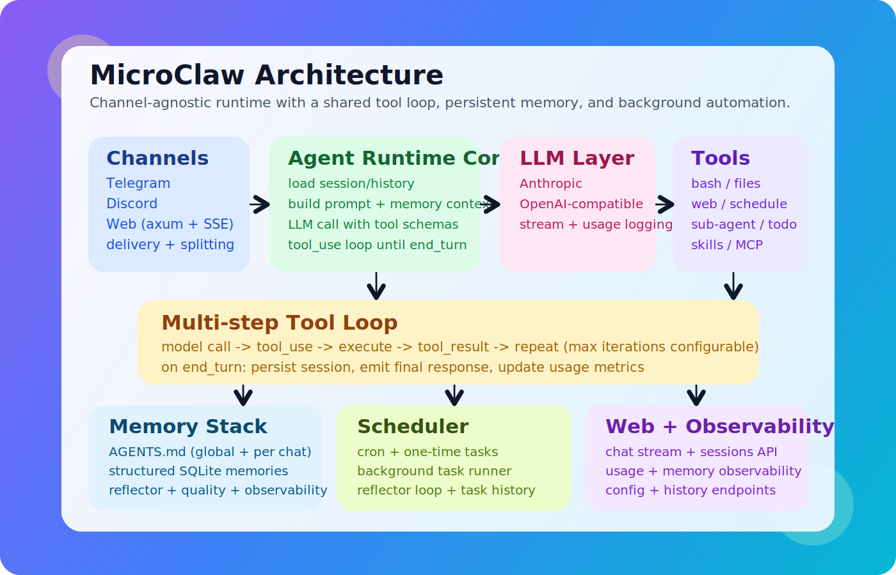

## <a id="ch19"></a>第19章 配置项设计百科：意图、风险与反模式

本章导读：本章围绕该主题展开，先交代问题背景，再说明实现与取舍，最后给出实践建议。

### <a id="ch19-1"></a>19.1 阅读方式

本章按“配置项字典”形式展开。每个条目包含四个维度：

1. 设计意图：这个参数为什么存在。
2. 风险点：配置不当会出什么问题。
3. 推荐策略：常见环境下如何设置。
4. 反模式：最常见误配方式。

### <a id="ch19-2"></a>19.2 LLM 组

#### 1) `llm_provider`

- 设计意图：抽象多家模型提供商。
- 风险点：provider 能力差异导致行为漂移。
- 推荐策略：生产固定 provider 并版本化。
- 反模式：在同环境频繁切换 provider 但无回归。

#### 2) `api_key`

- 设计意图：统一 provider 凭据注入。
- 风险点：空值在某些 provider 下会启动失败。
- 推荐策略：通过环境注入并避免落盘明文。
- 反模式：把 key 直接提交到配置文件仓库。

#### 3) `model`

- 设计意图：显式模型选择。
- 风险点：默认模型变化造成不可控升级。
- 推荐策略：生产固定模型名，升级走灰度。
- 反模式：依赖 provider 默认模型且无监控。

#### 4) `llm_base_url`

- 设计意图：支持私有网关与兼容端点。
- 风险点：网关不兼容工具调用协议。
- 推荐策略：上线前做工具回合兼容压测。
- 反模式：替换网关后只测纯文本对话。

#### 5) `max_tokens`

- 设计意图：限制单次输出长度。
- 风险点：过低导致关键信息截断。
- 推荐策略：按任务模板分层配置。
- 反模式：为了省钱统一设置很小上限。

#### 6) `max_tool_iterations`

- 设计意图：限制循环失控。
- 风险点：过低无法完成复杂任务；过高耗时增加。
- 推荐策略：先保守高值，再用数据下调。
- 反模式：为了快把上限压到个位数。

### <a id="ch19-3"></a>19.3 上下文与记忆组

#### 7) `max_history_messages`

- 设计意图：控制历史窗口规模。
- 风险点：窗口过大导致噪声堆积。
- 推荐策略：群聊比私聊更保守。
- 反模式：把它当“越大越聪明”指标。

#### 8) `max_session_messages`

- 设计意图：触发压缩前的会话上限。
- 风险点：过高导致会话臃肿。
- 推荐策略：结合 compaction 观察延迟。
- 反模式：只调它，不调压缩保留量。

#### 9) `compact_keep_recent`

- 设计意图：压缩后保留近期上下文。
- 风险点：过低丢失最近关键动作。
- 推荐策略：保持足够覆盖最近执行轨迹。
- 反模式：为了节省 token 把它设为极小。

#### 10) `memory_token_budget`

- 设计意图：限制记忆注入成本。
- 风险点：预算过低导致“假失忆”。
- 推荐策略：配合注入日志迭代调优。
- 反模式：只看主观体验，不看注入统计。

#### 11) `reflector_enabled`

- 设计意图：控制后台记忆提取开关。
- 风险点：关闭后长期记忆演进停滞。
- 推荐策略：生产默认开启。
- 反模式：因一次误提取就永久关闭。

#### 12) `reflector_interval_mins`

- 设计意图：平衡提取频率与成本。
- 风险点：间隔过短会增加系统负担。
- 推荐策略：按对话密度分环境设置。
- 反模式：统一高频而不看业务活跃度。

### <a id="ch19-4"></a>19.4 路径与隔离组

#### 13) `data_dir`

- 设计意图：统一运行时数据根目录。
- 风险点：路径变化导致状态迁移混乱。
- 推荐策略：生产绑定稳定持久卷。
- 反模式：部署脚本每次生成新路径。

#### 14) `skills_dir`

- 设计意图：可选覆盖技能目录。
- 风险点：与 data_dir 技能目录混用产生歧义。
- 推荐策略：团队内统一一种来源。
- 反模式：同环境多技能目录并存。

#### 15) `working_dir`

- 设计意图：工具默认工作路径。
- 风险点：误指向系统敏感目录。
- 推荐策略：专用目录 + 权限最小化。
- 反模式：直接指向用户 home 根目录。

#### 16) `working_dir_isolation`

- 设计意图：共享或按 chat 隔离。
- 风险点：shared 模式跨会话污染。
- 推荐策略：多用户环境优先 chat。
- 反模式：为了方便全量使用 shared。

#### 17) `timezone`

- 设计意图：调度时区统一。
- 风险点：时区错配导致任务错时执行。
- 推荐策略：显式配置并与团队约定一致。
- 反模式：依赖系统默认时区。

### <a id="ch19-5"></a>19.5 Sandbox 组

#### 18) `sandbox.mode`

- 设计意图：控制执行隔离开关。
- 风险点：off 模式在高风险场景暴露宿主。
- 推荐策略：生产逐步迁移到 all。
- 反模式：认为开启一次后永远安全。

#### 19) `sandbox.backend`

- 设计意图：后端选择（auto/docker）。
- 风险点：auto 下环境差异造成行为不一致。
- 推荐策略：关键环境固定后端并验收。
- 反模式：跨环境混用且不做自检。

#### 20) `sandbox.image`

- 设计意图：指定容器执行镜像。
- 风险点：镜像缺依赖导致命令失败。
- 推荐策略：维护组织级基线镜像。
- 反模式：临时换镜像但不做回归。

#### 21) `sandbox.container_prefix`

- 设计意图：容器命名隔离。
- 风险点：前缀冲突导致清理困难。
- 推荐策略：按环境设置唯一前缀。
- 反模式：多实例共用同前缀。

#### 22) `sandbox.no_network`

- 设计意图：限制容器外联。
- 风险点：误关闭导致数据外传面扩大。
- 推荐策略：默认 true，按需放开。
- 反模式：为图省事全局关闭网络隔离。

#### 23) `sandbox.require_runtime`

- 设计意图：runtime 不可用时行为策略。
- 风险点：false 导致静默回退宿主。
- 推荐策略：生产设为 true。
- 反模式：不知道其值就上线。

#### 24) `sandbox.mount_allowlist_path`

- 设计意图：显式挂载白名单。
- 风险点：缺失时挂载边界过宽。
- 推荐策略：配置并版本化管理。
- 反模式：上线后从不维护 allowlist。

#### 25) `sandbox.memory_limit`

- 设计意图：限制内存占用。
- 风险点：过小导致频繁 OOM。
- 推荐策略：按压测结果分层配置。
- 反模式：拍脑袋设置固定小值。

#### 26) `sandbox.cpu_quota`

- 设计意图：控制 CPU 份额。
- 风险点：过低导致执行超时增多。
- 推荐策略：按任务类型设置范围。
- 反模式：所有环境统一极限压缩。

#### 27) `sandbox.pids_limit`

- 设计意图：限制进程数。
- 风险点：某些工具链需要更多子进程。
- 推荐策略：先测后配，留安全余量。
- 反模式：不测试就设置过低。

### <a id="ch19-6"></a>19.6 Web 控制面组

#### 28) `web_enabled`

- 设计意图：控制 Web 控制面开关。
- 风险点：无需求暴露额外攻击面。
- 推荐策略：不用就关闭。
- 反模式：默认开启却从不维护。

#### 29) `web_host`

- 设计意图：绑定监听地址。
- 风险点：0.0.0.0 暴露公网风险。
- 推荐策略：默认 loopback，公网需额外防护。
- 反模式：开发便捷配置直接复制到生产。

#### 30) `web_port`

- 设计意图：控制入口端口。
- 风险点：与现有服务冲突。
- 推荐策略：纳入基础设施端口管理。
- 反模式：多实例共享同端口。

#### 31) `web_auth_token`

- 设计意图：legacy token 鉴权。
- 风险点：单 token 粒度粗、轮换困难。
- 推荐策略：迁移到 scoped API key。
- 反模式：长期依赖单 token。

#### 32) `web_max_inflight_per_session`

- 设计意图：控制会话并发。
- 风险点：过高导致资源争抢。
- 推荐策略：先低后高，逐步放量。
- 反模式：按峰值一次性放开。

#### 33) `web_max_requests_per_window`

- 设计意图：窗口内请求限额。
- 风险点：过大导致突发洪峰。
- 推荐策略：结合窗口长度共同调参。
- 反模式：只调请求数不调窗口。

#### 34) `web_rate_window_seconds`

- 设计意图：限流时间窗口。
- 风险点：过短但额度高，等效放水。
- 推荐策略：与请求额度成比例设置。
- 反模式：为了“快”把窗口压太短。

#### 35) `web_run_history_limit`

- 设计意图：流式历史缓存上限。
- 风险点：过小影响回放，过大占内存。
- 推荐策略：按会话并发估算。
- 反模式：忽略历史面板需求。

#### 36) `web_session_idle_ttl_seconds`

- 设计意图：闲置会话清理。
- 风险点：过低引发频繁锁抖动。
- 推荐策略：不少于用户常见停顿时长。
- 反模式：设得极短导致体验波动。

### <a id="ch19-7"></a>19.7 渠道与权限组

#### 37) `control_chat_ids`

- 设计意图：定义跨 chat 操作特权。
- 风险点：配置过宽会放大误操作半径。
- 推荐策略：最小化，定期审计。
- 反模式：把所有 chat 都设成 control。

#### 38) `channels.telegram.enabled`

- 设计意图：控制 Telegram 适配器开关。
- 风险点：误开导致无 token 启动异常。
- 推荐策略：按部署目标启用。
- 反模式：模板复制后忘记关闭未用渠道。

#### 39) `channels.telegram.bot_token`

- 设计意图：Telegram 凭据。
- 风险点：泄露后可被接管。
- 推荐策略：密钥托管 + 定期轮换。
- 反模式：明文写入共享文档。

#### 40) `channels.telegram.allowed_groups`

- 设计意图：群组白名单。
- 风险点：空列表即全开放。
- 推荐策略：生产用白名单精确控制。
- 反模式：不知道空列表语义。

#### 41) `channels.discord.enabled`

- 设计意图：控制 Discord 适配器。
- 风险点：误启造成多渠道意外响应。
- 推荐策略：按环境显式启停。
- 反模式：所有渠道默认全开。

#### 42) `channels.discord.allowed_channels`

- 设计意图：限制可响应频道。
- 风险点：未设会扩大响应范围。
- 推荐策略：仅开放业务频道。
- 反模式：测试期配置长期保留。

#### 43) `channels.web.enabled`

- 设计意图：统一 Web 频道启用位。
- 风险点：与 legacy `web_enabled` 混淆。
- 推荐策略：统一使用新字段。
- 反模式：新旧字段同时改，结果不可预期。

### <a id="ch19-8"></a>19.8 语音、技能与扩展组

#### 44) `voice_provider`

- 设计意图：语音转写 provider 选择。
- 风险点：本地命令路径不可用。
- 推荐策略：先验证命令模板。
- 反模式：切换 provider 不做回归。

#### 45) `voice_transcription_command`

- 设计意图：本地转写命令模板。
- 风险点：命令注入与依赖缺失。
- 推荐策略：固定模板并限制参数来源。
- 反模式：允许用户输入直接拼接命令。

#### 46) `clawhub_registry`

- 设计意图：技能仓库地址。
- 风险点：不可信源带来供应链风险。
- 推荐策略：固定可信 registry。
- 反模式：临时切换未知源。

#### 47) `clawhub_token`

- 设计意图：访问私有技能仓库。
- 风险点：token 泄露可导致越权下载。
- 推荐策略：最小权限 token。
- 反模式：高权限 token 长期不轮换。

#### 48) `clawhub_agent_tools_enabled`

- 设计意图：是否开放 agent 侧 clawhub 工具。
- 风险点：开放后技能安装面扩大。
- 推荐策略：按治理能力决定是否开启。
- 反模式：开启后无审计。

### <a id="ch19-9"></a>19.9 费用与可观测组

#### 49) `model_prices`

- 设计意图：成本估算映射表。
- 风险点：价格未更新导致成本误判。
- 推荐策略：定期同步真实价格。
- 反模式：把历史价格长期当真。

#### 50) `openai_api_key`（转写等扩展场景）

- 设计意图：隔离语音能力凭据。
- 风险点：与主模型 key 混用造成权限不清。
- 推荐策略：按功能拆分 key。
- 反模式：一个 key 覆盖所有服务。

### <a id="ch19-10"></a>19.10 配置治理总原则

1. 把配置看作“系统行为编码”，不是部署杂项。
2. 每次改配置都要有变更理由和回滚路径。
3. 安全参数默认收敛，效率参数逐步放开。
4. 参数调优要有观测数据支撑。
5. 将高风险配置纳入自动自检与发布门禁。

### <a id="ch19-11"></a>19.11 本章小结

本章将配置项从“字段列表”转化为“行为与风险映射”。理解配置的设计意图，才能在不同部署环境中做出稳健决策。

下一章将以事故复盘形式，展示如何用这些机制处理真实故障。

### 源码片段与图示

#### 图示：配置与运行时关系



#### 源码片段：Config 结构字段（节选，`src/config.rs`）

```rust
#[derive(Clone, Debug, Serialize, Deserialize)]
pub struct Config {
    #[serde(default = "default_llm_provider")]
    pub llm_provider: String,
    #[serde(default = "default_max_tool_iterations")]
    pub max_tool_iterations: usize,
    #[serde(default)]
    pub sandbox: SandboxConfig,
    #[serde(default = "default_control_chat_ids")]
    pub control_chat_ids: Vec<i64>,
    #[serde(default = "default_web_max_inflight_per_session")]
    pub web_max_inflight_per_session: usize,
}
```

#### 源码片段：默认值函数（节选）

```rust
fn default_max_tool_iterations() -> usize { 100 }
fn default_memory_token_budget() -> usize { 1500 }
fn default_web_rate_window_seconds() -> u64 { 10 }
fn default_reflector_interval_mins() -> u64 { 15 }
```
