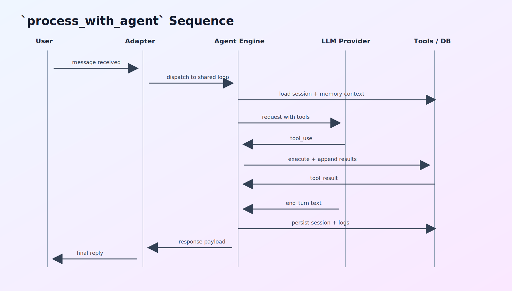

## <a id="ch22"></a>第22章 实战练习题库：从入门到进阶的工程训练营

### <a id="ch22-1"></a>22.1 练习目标与方法

本章不再给“重复模板题”，而是给一套可落地的训练营。每个练习都满足四个条件：

1. 能在真实代码与配置上操作。
2. 有清晰的验收标准。
3. 有对应源码位置可对照。
4. 有失败场景与回滚思路。

建议执行节奏：

1. 每次只做 1 个练习，必须写 todo。
2. 每次练习都保留“执行记录 + 结论 + 改进项”。
3. 每做完 4 个练习，复盘一次共性问题。

### <a id="ch22-2"></a>22.2 训练地图（图示）





### <a id="ch22-3"></a>22.3 基础营（6 练）

#### 练习1：识别一次请求的完整执行链

- 目标：从入站消息追踪到最终回复。
- 操作：
1. 阅读 `src/agent_engine.rs` 主流程。
2. 标注消息准备、提示词构建、工具循环、会话保存四段代码。
3. 手动画出状态转移图。
- 验收：能解释 `tool_use` 与 `end_turn` 两种分支的差异。
- 源码锚点：`src/agent_engine.rs`。

#### 练习2：验证 `max_tool_iterations` 收口行为

- 目标：确认循环触顶时系统不会协议损坏。
- 操作：
1. 设置较低 `max_tool_iterations`。
2. 构造需要多工具步骤的请求。
3. 观察返回是否包含“达到上限”提示，session 是否仍可恢复。
- 验收：下一轮请求不出现 tool_result 顺序错误。
- 源码锚点：`src/agent_engine.rs` 上限收口分支。

#### 练习3：验证工具执行策略前置校验

- 目标：确认策略在工具执行前生效。
- 操作：
1. 阅读 `execute_with_auth`。
2. 人工构造 policy 不满足场景。
3. 观察错误类型是否为 `execution_policy_blocked`。
- 验收：工具实现未执行就被拦截。
- 源码锚点：`src/tools/mod.rs`, `crates/microclaw-tools/src/runtime.rs`。

#### 练习4：验证高风险审批门

- 目标：确认高风险工具具备审批节奏。
- 操作：
1. 使用 web 或 control chat 场景触发 `bash`。
2. 观察首次调用返回。
3. 观察自动重试后是否可继续。
- 验收：能清楚解释“为何 first call 不是直接执行”。
- 源码锚点：`src/tools/mod.rs` 测试 `approval_required`。

#### 练习5：验证会话恢复优先级

- 目标：理解 session 与 DB 回退路径。
- 操作：
1. 执行多轮对话。
2. 人为破坏 session 内容。
3. 观察是否回退到 DB 历史重建。
- 验收：系统在 session 异常时仍能处理请求。
- 源码锚点：`src/agent_engine.rs` session 分支。

#### 练习6：验证 todo 执行纪律

- 目标：确保多步骤任务有可视计划。
- 操作：
1. 给出复杂任务。
2. 检查是否先写 todo。
3. 检查每步状态是否同步更新。
- 验收：任务结束时 todo 与实际结果一致。
- 源码锚点：系统提示词 playbook（`src/agent_engine.rs`）。

### <a id="ch22-4"></a>22.4 进阶营（8 练）

#### 练习7：沙箱 fail-open 与 fail-closed 对比

- 目标：理解 `require_runtime` 的生产含义。
- 操作：
1. 在无 docker 场景启用 sandbox。
2. 分别设置 `require_runtime=false/true`。
3. 比较执行结果与日志。
- 验收：能给出环境分层推荐。
- 源码锚点：`crates/microclaw-tools/src/sandbox.rs`。

#### 练习8：挂载路径防护演练

- 目标：验证敏感目录与符号链接拦截。
- 操作：
1. 尝试配置含 `.ssh` 的路径。
2. 尝试配置符号链接路径。
3. 观察校验错误。
- 验收：两类路径均被拒绝或告警。
- 源码锚点：`validate_mount_dir` 相关函数。

#### 练习9：记忆注入预算调优

- 目标：避免“记忆太少/太多”。
- 操作：
1. 对同一任务用不同 `memory_token_budget`。
2. 对比最终答复准确性与上下文噪声。
3. 记录 injection logs。
- 验收：得到适合当前业务的预算区间。
- 源码锚点：`build_db_memory_context`。

#### 练习10：记忆污染防护演练

- 目标：理解反思提取的风险。
- 操作：
1. 构造“错误行为复述”类文本。
2. 观察 reflector 是否过滤。
3. 构造“纠正性 action item”文本，观察是否保留。
- 验收：能解释为何“坏事实”不能入长期记忆。
- 源码锚点：`should_skip_memory_poisoning_risk`。

#### 练习11：调度失败恢复与 DLQ 回放

- 目标：把失败任务转为可恢复流程。
- 操作：
1. 人工制造任务失败。
2. 使用 `list_scheduled_task_dlq` 查看失败记录。
3. 使用 `replay_scheduled_task_dlq` 重放。
- 验收：能追踪一次完整失败-回放-成功链。
- 源码锚点：`src/scheduler.rs` + `docs/operations/runbook.md`。

#### 练习12：跨 chat 权限矩阵测试

- 目标：验证普通 chat 与 control chat 差异。
- 操作：
1. 普通 chat 触发跨 chat 操作。
2. control chat 触发同动作。
3. 对比错误与成功路径。
- 验收：权限边界清晰、错误可解释。
- 源码锚点：`authorize_chat_access`。

#### 练习13：Web 自检驱动配置整改

- 目标：将 warning 转为执行项。
- 操作：
1. 调用 `/api/config/self_check`。
2. 按 severity 排序整改。
3. 复查 warning 数量变化。
- 验收：高风险 warning 清零。
- 源码锚点：`src/web/config.rs`。

#### 练习14：跨渠道一致性回归

- 目标：确保 Telegram/Discord/Web 行为一致。
- 操作：
1. 设计同一请求用例。
2. 分渠道执行并记录差异。
3. 区分“适配差异”与“核心逻辑差异”。
- 验收：核心语义一致，差异仅在传输层。
- 源码锚点：`src/channels/*`, `src/agent_engine.rs`。

### <a id="ch22-5"></a>22.5 实战营（8 练）

#### 练习15：故障注入与回滚演练

- 目标：验证发布失败时的响应速度。
- 操作：
1. 人为引入策略错误（测试环境）。
2. 触发 smoke 失败。
3. 执行回滚并验证指标恢复。
- 验收：有完整时间线和责任分工记录。

#### 练习16：工具超时预算分层

- 目标：建立 per-tool timeout 配置。
- 操作：
1. 收集 `bash/browser/web_fetch` 耗时分布。
2. 配置 `tool_timeout_overrides`。
3. 比较失败率变化。
- 验收：长尾超时下降且总耗时可控。

#### 练习17：子代理任务设计

- 目标：把子代理用于独立子问题而非泛化调用。
- 操作：
1. 选一个研究型子任务。
2. 明确输入边界与输出格式。
3. 检查主代理整合结果质量。
- 验收：子代理输出可直接复用，且无越权动作。

#### 练习18：结构化记忆生命周期治理

- 目标：处理冲突记忆与归档策略。
- 操作：
1. 写入旧事实，再写入更新事实。
2. 检查 supersede 关系。
3. 验证检索是否优先最新事实。
- 验收：旧事实不再误导主要回答。

#### 练习19：Hooks 策略注入演练

- 目标：在不改核心循环的前提下注入治理规则。
- 操作：
1. 编写一个 BeforeToolCall hook。
2. 限制高风险参数模式。
3. 验证 block/modify 行为。
- 验收：策略生效且不影响其他工具流程。

#### 练习20：指标到行动闭环

- 目标：从告警直接联动处置手册。
- 操作：
1. 定义 4 个核心 burn alert。
2. 为每个告警绑定 runbook 步骤。
3. 演练一次从告警到恢复的值班流程。
- 验收：值班成员无需口口相传也能完成处置。

#### 练习21：升级兼容性验证

- 目标：验证配置迁移与行为稳定。
- 操作：
1. 从旧配置迁移到新字段。
2. 跑稳定性 smoke。
3. 比对权限、调度、沙箱关键路径。
- 验收：无关键行为回退。

#### 练习22：成本可视化与配额治理

- 目标：将模型成本纳入发布验收。
- 操作：
1. 配置 `model_prices`。
2. 跟踪 7 天成本曲线。
3. 结合任务成功率做成本/收益评估。
- 验收：形成可执行的预算策略。

### <a id="ch22-6"></a>22.6 关键源码片段（练习速查）

#### 片段A：工具策略前置

```rust
if let Err(msg) =
    validate_execution_policy(name, self.sandbox_mode, self.sandbox_runtime_available)
{
    return ToolResult::error(msg).with_error_type("execution_policy_blocked");
}
```

#### 片段B：沙箱运行时不可用分支

```rust
if !self.backend.is_real() {
    if self.config.require_runtime {
        bail!("sandbox is enabled but no docker runtime is available");
    }
    return exec_host_command(command, opts).await;
}
```

#### 片段C：调度复用 Agent Loop

```rust
process_with_agent(
    state,
    AgentRequestContext {
        caller_channel: &routing.channel_name,
        chat_id: task.chat_id,
        chat_type: routing.conversation.as_agent_chat_type(),
    },
    Some(&task.prompt),
    None,
)
.await
```

#### 片段D：失败写入 DLQ

```rust
if !success {
    db.insert_scheduled_task_dlq(
        task.id,
        task.chat_id,
        &started_for_dlq,
        &finished_for_dlq,
        duration_ms,
        dlq_summary.as_deref(),
    )?;
}
```

### <a id="ch22-7"></a>22.7 本章小结

训练题库的重点不是题目数量，而是让团队形成统一执行习惯：先约束边界，再收集证据，再做最小改动，再完成复盘闭环。
