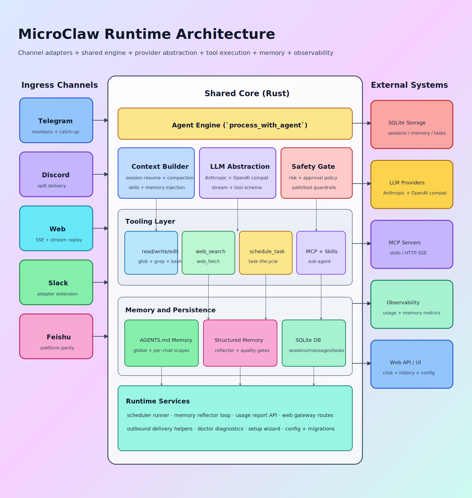
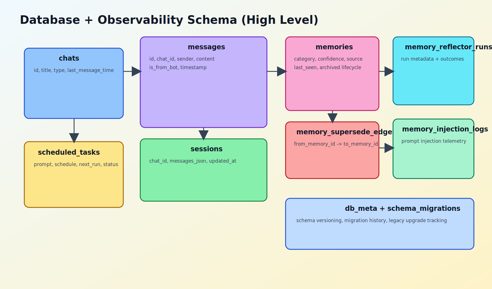
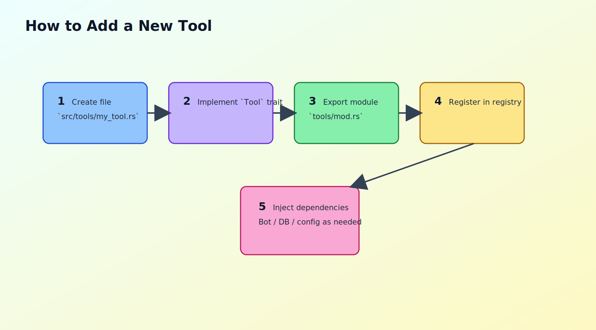

## <a id="ch23"></a>第23章 设计决策备忘录：真实 ADR 清单与证据链

本章导读：本章围绕该主题展开，先交代问题背景，再说明实现与取舍，最后给出实践建议。

### <a id="ch23-1"></a>23.1 使用说明

本章改为“真实 ADR + 代码证据”的方式，不再使用模板化重复文本。每条 ADR 包含：

1. 决策问题。
2. 最终选择。
3. 取舍分析。
4. 代码证据或文档证据。
5. 未来调整触发条件。

### <a id="ch23-2"></a>23.2 核心 ADR（架构层）

#### ADR-01：坚持共享 Agent Loop，不做平台分叉

- 决策：所有渠道统一走 `process_with_agent`。
- 原因：减少行为漂移和维护成本。
- 代价：适配器必须严格边界化，不能偷渡业务逻辑。
- 证据：`src/agent_engine.rs`、README 中“不要新增平台专属 agent loop”。
- 触发再评估：当某平台出现不可绕开的协议差异且无法通过适配层消化。

#### ADR-02：工具策略前置校验

- 决策：在 `execute_with_auth` 里统一做 policy/risk/approval。
- 原因：保证每个工具调用都经过同一安全入口。
- 代价：工具层扩展时需维护策略映射。
- 证据：`src/tools/mod.rs` `execute_with_auth`。
- 再评估：若出现大量策略误拦截，需增强策略可配置性。

#### ADR-03：高风险工具走审批门

- 决策：`bash` 等高风险工具需审批流程。
- 原因：降低误操作与越权动作概率。
- 代价：交互会增加一次确认摩擦。
- 证据：`require_high_risk_approval` 调用与相关测试。
- 再评估：当审批噪声过高影响效率时，需引入更细粒度风险模型。

#### ADR-04：会话优先恢复，历史回退兜底

- 决策：先读 session，异常时回退 DB 历史。
- 原因：优先保证连续执行，再保证可恢复。
- 代价：需要维护 session 数据完整性。
- 证据：`src/agent_engine.rs` 消息加载分支。
- 再评估：当 session 损坏率上升时，需完善校验与修复。

#### ADR-05：显式记忆命令走快速路径

- 决策：识别“记住”指令并直接写结构化记忆。
- 原因：降低高频记忆请求延迟和 token 开销。
- 代价：需要质量闸门防止脏记忆进入。
- 证据：`maybe_handle_explicit_memory_command`。
- 再评估：若误识别率高，需增强语义判定。

#### ADR-06：上下文压缩是必须，不是可选优化

- 决策：超过阈值即压缩会话。
- 原因：避免上下文无限膨胀和重点信息淹没。
- 代价：压缩策略不当会丢信息。
- 证据：`max_session_messages` + `compact_messages` 路径。
- 再评估：当复杂任务中出现“压缩后失忆”时调整策略。

### <a id="ch23-3"></a>23.3 核心 ADR（安全与隔离层）

#### ADR-07：Sandbox 默认 off，但生产建议 all

- 决策：默认 `sandbox.mode=off`，提供快速启用与诊断。
- 原因：降低首配摩擦，兼顾落地速度。
- 代价：默认安全边界较弱。
- 证据：`docs/security/execution-model.md`。
- 再评估：当生产采用率提升后可讨论默认策略上调。

#### ADR-08：require_runtime 支持 fail-closed

- 决策：`require_runtime=true` 时无 runtime 即拒绝执行。
- 原因：避免“以为在沙箱，实际在宿主”。
- 代价：可用性下降，需要运维保障 runtime。
- 证据：`crates/microclaw-tools/src/sandbox.rs`。
- 再评估：当 runtime 稳定性不足时需引入高可用方案。

#### ADR-09：挂载路径必须做敏感组件与符号链接校验

- 决策：拒绝敏感路径和 symlink 组件。
- 原因：降低隔离绕过风险。
- 代价：某些灵活挂载场景受限。
- 证据：`validate_mount_dir`、`contains_symlink_component`。
- 再评估：当合法场景被频繁误拒绝时细化规则。

#### ADR-10：聊天作用域授权优先简洁规则

- 决策：普通 chat 仅操作自身，control chat 可跨域。
- 原因：最小可行权限模型，易审计。
- 代价：复杂协作场景权限粒度不足。
- 证据：`authorize_chat_access` 与 `ToolAuthContext`。
- 再评估：当多角色协作增多时扩展 RBAC。

#### ADR-11：Web 控制面走 scope 化授权路线

- 决策：从 legacy token 迁移到 session + API key + scope。
- 原因：便于权限拆分和密钥轮换。
- 代价：迁移期双轨维护复杂。
- 证据：`docs/rfcs/0001-authn-authz-model.md`。
- 再评估：legacy path 使用率足够低时彻底下线。

### <a id="ch23-4"></a>23.4 核心 ADR（记忆与调度层）

#### ADR-12：记忆采用双层模型（文件 + 结构化）

- 决策：同时保留 AGENTS.md 和 SQLite 结构化记忆。
- 原因：兼顾可读性与可检索治理能力。
- 代价：双写与一致性管理成本更高。
- 证据：README_CN 与 `src/scheduler.rs`。
- 再评估：当双层维护成本过高时需做抽象收敛。

#### ADR-13：Reflector 周期提取长期记忆

- 决策：后台任务按间隔提取 durable facts。
- 原因：让记忆系统具备长期学习能力。
- 代价：可能引入噪声与污染。
- 证据：`REFLECTOR_SYSTEM_PROMPT` 与过滤函数。
- 再评估：提取噪声率持续上升时加强规则与评估。

#### ADR-14：记忆注入受 token budget 约束

- 决策：注入内容受 `memory_token_budget` 控制并记录日志。
- 原因：避免挤占主任务上下文。
- 代价：预算过低会损失记忆召回。
- 证据：`build_db_memory_context`。
- 再评估：按任务类型引入动态预算策略。

#### ADR-15：调度失败必须进入 DLQ

- 决策：任务失败写入 DLQ 并支持 replay。
- 原因：把失败从终态变中间态。
- 代价：需要维护重放幂等与队列治理。
- 证据：`insert_scheduled_task_dlq` 与 runbook。
- 再评估：DLQ 长期堆积时引入自动补偿策略。

#### ADR-16：调度执行复用主 Agent Loop

- 决策：scheduler 不自建执行引擎。
- 原因：保持人工触发与定时触发语义一致。
- 代价：scheduler 受主 loop 复杂性影响。
- 证据：`src/scheduler.rs` `process_with_agent(...)`。
- 再评估：当后台任务特性明显不同再考虑分层。

### <a id="ch23-5"></a>23.5 核心 ADR（可观测与运维层）

#### ADR-17：自检接口输出风险分级

- 决策：`/api/config/self_check` 输出 warning + severity。
- 原因：把风险显性化并可自动化消费。
- 代价：规则需持续维护，否则误报漏报。
- 证据：`src/web/config.rs`。
- 再评估：误报率高时增加上下文化建议。

#### ADR-18：SLO 不只看请求成功率

- 决策：增加 tool reliability 与 scheduler recoverability。
- 原因：Agent runtime 关键风险在执行链路而非 HTTP 表层。
- 代价：指标解释门槛更高。
- 证据：`docs/operations/runbook.md`, `docs/observability/metrics.md`。
- 再评估：指标过多难维护时做精简聚焦。

#### ADR-19：稳定性 smoke 进入交付门禁

- 决策：把关键回归纳入统一 smoke 套件。
- 原因：防止隐性契约回归进入主干。
- 代价：CI 时间增长。
- 证据：runbook 中 Stability Gate 说明。
- 再评估：门禁过慢时优化并行与样本选择。

#### ADR-20：runbook 必须绑定可执行工具

- 决策：每个操作建议都尽量映射到具体 API/工具。
- 原因：减少值班期间“知道原则但不会操作”。
- 代价：文档维护成本增加。
- 证据：runbook 中 DLQ replay、metrics 查询指令。
- 再评估：当文档和实现漂移时建立自动校验。

### <a id="ch23-6"></a>23.6 关键代码证据片段

#### 片段1：统一工具执行入口

```rust
if let Err(msg) =
    validate_execution_policy(name, self.sandbox_mode, self.sandbox_runtime_available)
{
    return ToolResult::error(msg).with_error_type("execution_policy_blocked");
}
if let Some(blocked) = require_high_risk_approval(name, auth) {
    return blocked;
}
```

#### 片段2：sandbox runtime 不可用分支

```rust
if !self.backend.is_real() {
    if self.config.require_runtime {
        bail!("sandbox is enabled but no docker runtime is available");
    }
    tracing::warn!("sandbox enabled but docker unavailable, falling back to host");
    return exec_host_command(command, opts).await;
}
```

#### 片段3：调度失败写入 DLQ

```rust
if !success {
    db.insert_scheduled_task_dlq(
        task.id,
        task.chat_id,
        &started_for_dlq,
        &finished_for_dlq,
        duration_ms,
        dlq_summary.as_deref(),
    )?;
}
```

### <a id="ch23-7"></a>23.7 图示与定位







### <a id="ch23-8"></a>23.8 本章小结

真正有价值的 ADR 不是“写了多少条”，而是每条都能对应到代码、测试、运维动作，并在演进中可持续修订。本章给出的 20 条决策，是 MicroClaw 当前工程化主干的可执行抽象。
