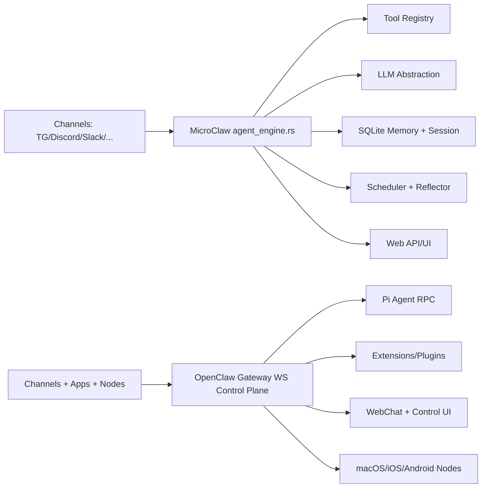

# MicroClaw vs OpenClaw：从工程可控性到全平台能力的深度对比

> 对比基准时间：2026-02-27（本地克隆快照）
> - MicroClaw 最新提交：`a061598`（2026-02-27）
> - OpenClaw 最新提交：`f943c76`（2026-02-27）

## 1. 背景与产品定位

**MicroClaw** 的核心定位是「Rust 多渠道 agent runtime」，强调统一 agent loop、统一 LLM 抽象、可控内存与可观测性，目标是让个人或小团队以较低复杂度构建稳定的“聊天入口型 AI 自动化系统”。

**OpenClaw** 的定位更像「全栈个人 AI 网关平台」：控制平面、WebChat、移动节点、Canvas、语音、多渠道生态、插件扩展并重，追求覆盖面和生态速度。

一句话总结：
- MicroClaw：偏“工程可控 + 架构内聚”。
- OpenClaw：偏“平台广度 + 生态外延”。

## 2. 架构总览对比（配图）

## 3. 技术栈与代码组织

| 维度 | MicroClaw | OpenClaw |
|---|---|---|
| 主语言 | Rust | TypeScript（并含 Swift/Kotlin 等端侧代码） |
| 代码组织 | Rust workspace（`crates/*` + `src/*`） | 大型 monorepo（`extensions/`、`apps/`、`ui/` 等） |
| 依赖与运行时 | 单二进制导向，Tokio + rusqlite + axum | Node.js + pnpm 生态，组件多、依赖面广 |
| 规模信号（快照） | `src+crates` 约 62k 行 | TS/JS 约 885k 行 |

工程含义：OpenClaw 功能面更广，但治理成本显著更高；MicroClaw 在可审计性、可维护性上更友好。

## 4. Agent Loop 与工具执行策略

### MicroClaw
- 明确的 `process_with_agent` 循环。
- 有显式记忆 fast-path（`remember ...`）与会话压缩（compaction）。
- 工具调用、hook、高风险工具确认、session 持久化形成闭环。

### OpenClaw
- 以 Gateway + Pi agent RPC 为核心。
- 强调控制平面统一接入多端与多渠道，工具与扩展系统更平台化。

对比结论：
- 如果你要“可读、可调、可控”的 loop 行为，MicroClaw 更直接。
- 如果你要“多端统一控制 + 大量外部扩展”，OpenClaw 优势明显。

## 5. 内存系统与上下文管理

### MicroClaw
- 双层内存：`AGENTS.md` 文件记忆 + SQLite 结构化记忆。
- 支持记忆质量门控、supersede 边、反射器（reflector）和注入观测日志。
- `sqlite-vec` 可选启用语义检索。

### OpenClaw
- 多处提到 memory 扩展与技能体系联动（含 memory-core / lancedb 方向）。
- 更偏插件化演进路线。

结论：
- MicroClaw 在“内存质量治理与可观测闭环”上更内建。
- OpenClaw 在“内存能力外接与生态拼装”上更灵活。

## 6. 安全与隔离模型

### MicroClaw
- 高风险工具可强制用户确认。
- 可切换 Docker sandbox；默认配置强调多聊天权限边界。
- Hooks 可在工具前后做策略控制。

### OpenClaw
- 强调 DM 访问默认策略、配对与网关安全文档体系。
- 提供更完整的网关暴露/远程访问指导（Tailscale、Remote Gateway）。

结论：
- MicroClaw：偏“runtime 内核策略化控制”。
- OpenClaw：偏“平台与网络暴露场景的体系化运维安全”。

## 7. 渠道与生态扩展

- 两者都支持 Telegram/Discord/Slack 等主流渠道。
- OpenClaw 在渠道与端侧节点（macOS/iOS/Android）明显更重。
- MicroClaw 在 MCP、技能、插件方面更强调“核心 loop 不破碎”的接入方式。

## 8. 运维与可观测性

### MicroClaw
- OTLP 导出、memory observability API、usage 汇总、web metrics 历史。
- 更适合做“内生可观测 + 本地自治”。

### OpenClaw
- 文档与运行手册更平台化，覆盖大量部署/网络场景。

## 9. 选型建议

适合 **MicroClaw**：
- 你要 Rust 代码基、可维护和可审计优先。
- 你关心 memory 质量治理、session 压缩、任务调度一致性。

适合 **OpenClaw**：
- 你要多端能力、渠道广覆盖和更丰富生态插件。
- 你可接受更高的系统复杂度与 Node 侧运维成本。

## 10. 对 MicroClaw 的可执行借鉴

1. 引入更清晰的“控制平面”抽象（参考 OpenClaw Gateway 心智模型）。
2. 加强端侧节点能力（移动端/桌面端执行代理）与统一权限协议。
3. 增强插件生态文档化和发现机制，降低第三方接入门槛。

## 参考资料

- https://github.com/openclaw/openclaw
- https://github.com/openclaw/openclaw/blob/main/README.md
- https://github.com/openclaw/openclaw/blob/main/package.json
- 本地仓库：`/Users/eevv/focus/microclaw`
