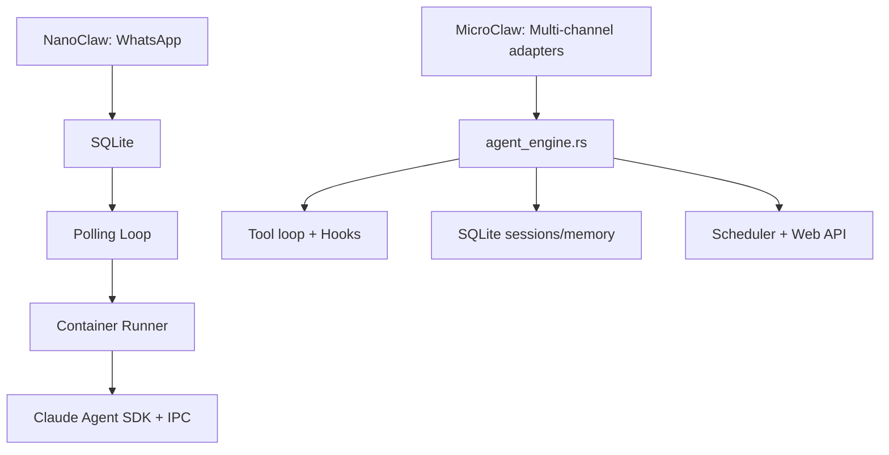

# MicroClaw vs NanoClaw：同为“可控”路线，但方法论几乎相反

> 对比基准时间：2026-02-27（本地克隆快照）
> - MicroClaw 最新提交：`a061598`（2026-02-27）
> - NanoClaw 最新提交：`8f91d3b`（2026-02-27）

## 1. 定位差异

NanoClaw 的核心叙事是：
- 极简代码面（小规模 Node 项目）
- 强隔离（agent 在容器中执行）
- “Skills over features”（通过技能改造，而非不断往主干加功能）

MicroClaw 的核心叙事是：
- Rust 统一核心循环
- 多渠道原生适配
- 内置 memory、scheduler、hooks、web API 等完整运行时能力

**本质差异**：
- NanoClaw：极简主干 + 强依赖技能变更。
- MicroClaw：主干内建能力更完整，技能是增量扩展。

## 2. 架构与执行模型（配图）

NanoClaw README 直接给出了线性链路：WhatsApp -> SQLite -> Polling -> 容器 Agent。MicroClaw 则是事件驱动/多模块协作的 runtime。

## 3. 技术栈与复杂度

| 维度 | MicroClaw | NanoClaw |
|---|---|---|
| 主语言 | Rust | TypeScript (Node.js 20+) |
| 数据库 | rusqlite (bundled sqlite) | better-sqlite3 |
| 主要渠道策略 | 多渠道内建 | 默认 WhatsApp，其他能力通过 skill 路线扩展 |
| 规模信号 | 约 62k 行（src+crates） | TS/JS 约 15k 行 |

NanoClaw 的优势是“可读到极致”；MicroClaw 的优势是“能力密度与可扩展边界更大”。

## 4. 工具系统与扩展哲学

### NanoClaw
- 明确提出“不加 feature，优先加 skill”。
- `skills-engine` 提供变更/重放/合并/迁移等能力，强调“由 AI 修改你的 fork”。

### MicroClaw
- 工具由 `src/tools/*` + `microclaw-tools` runtime 统一治理。
- 支持 MCP、插件、技能，同时保留强主干能力。

结论：
- NanoClaw 更像“极简内核 + 生成式定制流水线”。
- MicroClaw 更像“通用运行时 + 多种扩展机制并存”。

## 5. 内存与调度

### NanoClaw
- 每群组 `groups/*/CLAUDE.md` 记忆。
- 独立 `task-scheduler.ts`，结构简单直观。

### MicroClaw
- 文件记忆 + 结构化记忆（含质量门控、去重、supersede）。
- 调度器与 reflector、usage/observability 体系打通。

结论：
- NanoClaw：轻量、直接。
- MicroClaw：更强的数据治理与长期运行稳定性。

## 6. 安全模型

NanoClaw 把“容器隔离”作为核心卖点；MicroClaw 把“高风险工具审批 + sandbox 模式 + hooks 策略”作为可配置治理。

这两条路线并不冲突：
- NanoClaw 偏“默认隔离强度高”。
- MicroClaw 偏“可配置策略深度更高”。

## 7. 工程演进风险

### NanoClaw 风险
- 过度依赖 skill 改造，fork 间行为一致性较难保证。
- 当需求增多时，主干过轻可能转化为“隐藏复杂度外溢”。

### MicroClaw 风险
- 主干能力多，必须持续控制架构边界与文档一致性。
- 需要更严格的回归策略确保多渠道一致行为。

## 8. 选型建议

选 **NanoClaw**：
- 你追求极简可读、快速 fork、自定义优先。
- 你能接受“通过技能持续改造主干”。

选 **MicroClaw**：
- 你要更稳的多渠道长期运行能力。
- 你希望 memory/scheduler/observability 在主干内一次性具备。

## 9. 对 MicroClaw 的借鉴建议

1. 借鉴 NanoClaw 的“极简架构叙事”，把关键链路画得更短更清晰。
2. 抽出“最小可运行模式”（minimal profile），降低新用户理解成本。
3. 提供 skill 驱动的“架构改造模板”，兼顾主干稳定与定制效率。

## 参考资料

- https://github.com/qwibitai/nanoclaw
- https://github.com/qwibitai/nanoclaw/blob/main/README.md
- https://github.com/qwibitai/nanoclaw/blob/main/README_zh.md
- https://github.com/qwibitai/nanoclaw/blob/main/package.json
- 本地仓库：`/Users/eevv/focus/microclaw`
