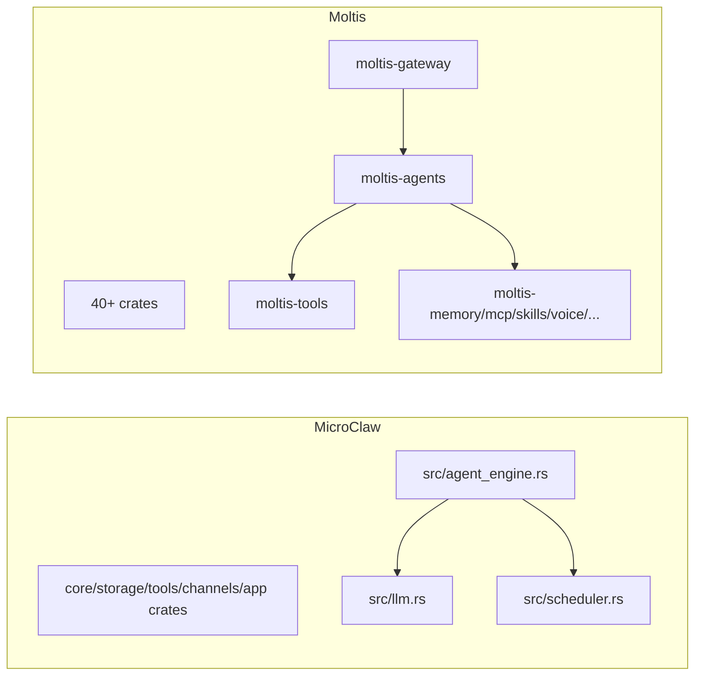

# MicroClaw vs Moltis：两种 Rust 大型工程路线的正面对照

> 对比基准时间：2026-02-27（本地克隆快照）
> - MicroClaw 最新提交：`a061598`（2026-02-27）
> - Moltis 最新提交：`fc300aa`（2026-02-27）

## 1. 战略定位

两者都选择 Rust，但产品策略不同：
- **MicroClaw**：聚焦多渠道 agent runtime 的“一体化主链路”，强调 agent loop、memory、scheduler、hooks、web API 的一致协作。
- **Moltis**：更像“Rust 原生 AI 网关平台”，crate 数量多、能力面广，强调安全、模块化、企业级可扩展。

## 2. 模块化深度对比（配图）

Moltis 的 workspace 规模显著更大（40+ crates），模块职责更细；MicroClaw 结构更紧凑。

## 3. 技术栈与工程治理

| 维度 | MicroClaw | Moltis |
|---|---|---|
| Rust 版本与风格 | Edition 2021 | Edition 2024，`unsafe` 禁用、`unwrap/expect` lint 约束 |
| 存储 | rusqlite（SQLite） | sqlx + SQLite（并覆盖更多平台能力） |
| Web 层 | axum | axum + 更丰富协议/安全组件 |
| 规模信号 | 约 62k 行（src+crates） | Rust 约 183k 行 |

Moltis 在“工程制度化治理”更重；MicroClaw 在“核心链路可理解性”更好。

## 4. Agent 与工具执行

### MicroClaw
- `agent_engine.rs` 聚合了：session resume、显式记忆 fast-path、compaction、tool loop、hooks。
- 工具注册与风控集中在 runtime。

### Moltis
- 将 agent、gateway、tools、sessions 等拆成多个 crate。
- 更利于团队并行开发和大型平台演进。

结论：
- MicroClaw：更适合小团队快速迭代核心功能。
- Moltis：更适合组织化分层协作和多子域并行。

## 5. 安全与合规能力

Moltis 在 README 中明确列出：
- Secret 零化/脱敏
- WebAuthn 等认证机制
- Hook gating
- Origin 校验

MicroClaw 当前也有高风险工具确认、hooks、权限模型，但在“认证体系与企业安全特性”公开叙事上较轻。

## 6. 渠道、MCP、技能与可扩展性

两者均支持 Telegram/Discord/MCP/技能体系。
区别在于：
- Moltis 把能力拆成更多独立 crate（channels/mcp/skills/voice 等）。
- MicroClaw 把它们放在更内聚的 runtime 主干和少量核心 crate 中。

## 7. 运维与可观测性

### MicroClaw
- OTLP、metrics history、memory observability 已串联在主应用路径。

### Moltis
- 在网关化部署、功能分层和长期平台治理方面更“企业平台范式”。

## 8. 适用场景判断

适合 **MicroClaw**：
- 小中型团队，希望高内聚、快速迭代 agent 主链路。
- 注重“功能上线速度 + 架构可读性”平衡。

适合 **Moltis**：
- 多团队协同、模块边界清晰、长期演进要求高。
- 需要更系统化的安全与平台能力分层。

## 9. 对 MicroClaw 的建议

1. 引入更明确的 crate 边界文档（按能力域而非技术点分层）。
2. 把安全能力做成“可声明策略清单”，提升对企业用户的可见性。
3. 对外提供“轻量模式/完整模式”能力矩阵，避免用户误判复杂度。

## 参考资料

- https://github.com/moltis-org/moltis
- https://github.com/moltis-org/moltis/blob/main/README.md
- https://github.com/moltis-org/moltis/blob/main/Cargo.toml
- 本地仓库：`/Users/eevv/focus/microclaw`
