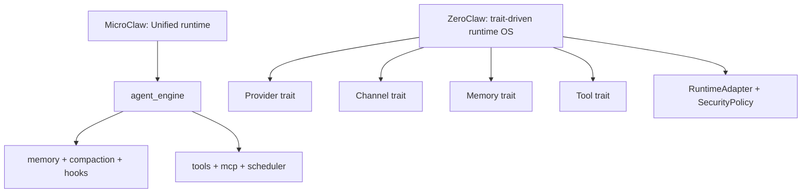

# MicroClaw vs ZeroClaw：同为 Rust，但一个务实内核，一个“全可插拔操作系统”

> 对比基准时间：2026-02-27（本地克隆快照）
> - MicroClaw 最新提交：`a061598`（2026-02-27）
> - ZeroClaw 最新提交：`a09f146`（2026-02-25）

## 1. 项目叙事与目标

**ZeroClaw** 把自己定义为 agent workflow 的 runtime OS：
- 强调 trait-driven、全链路可替换（Provider/Channel/Memory/Tool/Runtime/Tunnel/Identity）
- 强调低资源占用、跨硬件可移植
- 公开对比基准、强调“可复现 benchmark”

**MicroClaw** 的目标更聚焦在：
- 多渠道通用 agent loop
- 记忆体系质量治理
- 调度、hooks、web 与存储的一体化协同

## 2. 架构对比（配图）

ZeroClaw 的架构显式强调“每层都可替换”；MicroClaw 强调“主链路稳定内聚”。

## 3. 技术实现差异

| 维度 | MicroClaw | ZeroClaw |
|---|---|---|
| 代码组织 | `crates/*` + `src/*` | 根仓库 + `crates/robot-kit` + 大量 docs/templates/firmware |
| 依赖策略 | 核心依赖精简、聚焦 runtime | 特性旗标非常丰富（wasm-tools、whatsapp-web、memory-postgres、otel 等） |
| 渠道覆盖 | 多渠道、偏聊天应用 | 渠道非常广 + Webhook + 硬件/外围生态 |
| 规模信号 | 约 62k 行 | Rust+Python 约 196k 行 |

## 4. 内存系统路线

### MicroClaw
- 文件记忆 + SQLite 结构化记忆。
- 质量门控、去重/替代关系、注入日志、反射任务等实用闭环。

### ZeroClaw
- Memory trait + 多 backend（SQLite/Postgres/Markdown/none/Lucid）。
- 文档中强调 hybrid（FTS5 + vector）和多层参数可调。

结论：
- MicroClaw：偏“稳定默认 + 质量治理内建”。
- ZeroClaw：偏“高度可配置 + 后端可替换”。

## 5. 运行时与安全模型

ZeroClaw 在 README 中对 Runtime/Security 给出更大矩阵：native、docker、WASM（文档口径）、allowlist、pairing、secret 加密等。并提供大量 feature flag 组合。

MicroClaw 也有高风险工具确认、sandbox、hooks，但整体更偏“主干策略 + 少量关键开关”，学习与运维成本更低。

## 6. 运维与部署

- ZeroClaw 在部署入口（one-click/bootstrap/doctor/channel health）与兼容路径上覆盖非常广。
- MicroClaw 也具备 setup/doctor/web/config 自检，但范围更聚焦日常聊天 agent 运行。

## 7. 适用场景

适合 **MicroClaw**：
- 你要一个较少配置即可稳定运行的 Rust agent runtime。
- 你重视记忆质量、会话管理和可观测性闭环。

适合 **ZeroClaw**：
- 你要“平台级可替换”能力，且愿意管理复杂配置矩阵。
- 你要更激进的扩展面（硬件、runtime 组合、更多 provider/channel 形态）。

## 8. MicroClaw 可借鉴点

1. 增强 trait/interface 的对外文档化，让“可替换边界”更显式。
2. 引入可复现 benchmark 脚本与报告模板，持续量化性能演进。
3. 在部署工具链上提供更多“一键修复/迁移向导”能力。

## 参考资料

- https://github.com/zeroclaw-labs/zeroclaw
- https://github.com/zeroclaw-labs/zeroclaw/blob/main/README.md
- https://github.com/zeroclaw-labs/zeroclaw/blob/main/Cargo.toml
- 本地仓库：`/Users/eevv/focus/microclaw`
