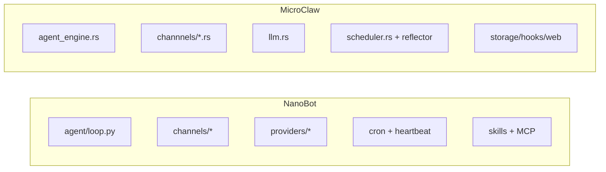

# MicroClaw vs NanoBot：Rust 一体化运行时 vs Python 轻量框架化实践

> 对比基准时间：2026-02-27（本地克隆快照）
> - MicroClaw 最新提交：`a061598`（2026-02-27）
> - NanoBot 最新提交：`a4d95fd`（2026-02-28 +08:00，折算到美国时区仍落在 2026-02-27）

## 1. 产品与工程定位

**NanoBot** 强调：
- Python 轻量核心（README 强调约 4k 行级别核心逻辑）
- 快速集成多渠道 + MCP + 周期任务
- 社区驱动迭代速度

**MicroClaw** 强调：
- Rust 统一 agent runtime
- 内置 memory 质量治理、scheduler、hooks、web observability
- 更稳定的长期运行与并发行为

## 2. 架构组织方式（配图）

NanoBot 的目录层次非常直观（`agent/channels/providers/cron/heartbeat`）；MicroClaw 模块边界更偏 Rust crate 级治理。

## 3. 技术栈与可维护性

| 维度 | MicroClaw | NanoBot |
|---|---|---|
| 主语言 | Rust | Python 3.11+ |
| LLM 抽象 | Anthropic + OpenAI-compatible + Codex 路线 | LiteLLM + 自有 provider registry |
| 数据层 | SQLite（rusqlite）+结构化记忆治理 | Python 生态下的持久化实现 |
| 规模信号 | 约 62k 行（src+crates） | Python 约 14.5k 行 |

结论：NanoBot 上手快、迭代快；MicroClaw 在边界清晰与运行稳定性上更强。

## 4. 记忆、任务与主动执行

### NanoBot
- `agent/memory.py`、`heartbeat/service.py`、`cron/service.py` 分离。
- 使用 `HEARTBEAT.md` 驱动周期唤醒，偏“轻协议 + 强实用”。

### MicroClaw
- 调度器与 agent loop、memory reflector、usage/memory observability 打通。
- 具备更完整的数据闭环与质量监控。

## 5. MCP 与技能体系

两者都支持 MCP 与技能。
- NanoBot 更强调“配置兼容 Claude Desktop/Cursor MCP 结构，开箱即用”。
- MicroClaw 更强调“在统一 runtime 内进行协议协商、工具注册与安全边界管理”。

## 6. 安全策略对比

NanoBot README 显式提示：生产环境建议 `restrictToWorkspace: true`，并通过 `allowFrom` 等白名单控制来源。

MicroClaw 在此基础上增加：
- 高风险工具用户确认
- hooks 风控点
- 多聊天权限模型与更细粒度运行时策略

## 7. 运维与生态成熟度

- NanoBot 社区节奏快，更新日志密度高，适合快速试验新能力。
- MicroClaw 的优势是“稳定可控的长期运行框架”，尤其适合对一致性要求更高的场景。

## 8. 选型建议

选 **NanoBot**：
- 你要 Python 生态、快速二次开发、低门槛试验。

选 **MicroClaw**：
- 你要 Rust 运行时稳定性、清晰边界和长期可演进体系。

## 9. 对 MicroClaw 的借鉴建议

1. 借鉴 NanoBot 的目录表达，把运行链路“可视化到文件级”。
2. 提供更轻量的“快速实验 profile”（弱化高级治理默认配置）。
3. 增加对 MCP config 兼容模板的一键导入体验。

## 参考资料

- https://github.com/HKUDS/nanobot
- https://github.com/HKUDS/nanobot/blob/main/README.md
- https://github.com/HKUDS/nanobot/blob/main/pyproject.toml
- 本地仓库：`/Users/eevv/focus/microclaw`
