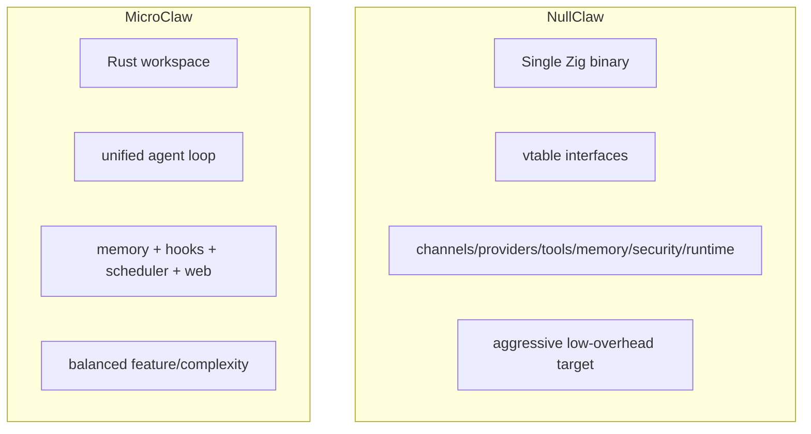

# MicroClaw vs NullClaw：务实 Rust 运行时与极限 Zig 单体的取舍

> 对比基准时间：2026-02-27（本地克隆快照）
> - MicroClaw 最新提交：`a061598`（2026-02-27）
> - NullClaw 最新提交：`834067a`（2026-02-27）

## 1. 核心定位

**NullClaw** 的主轴非常鲜明：
- 100% Zig
- 极小体积、低运行开销
- 以 vtable interface 组织可替换子系统

**MicroClaw** 的主轴是：
- Rust 多渠道 agent runtime
- 更平衡的能力完整度、可观测性与工程可维护性

## 2. 架构风格对比（配图）

NullClaw 是“极限工程表达”；MicroClaw 是“业务可用与工程稳态平衡”。

## 3. 技术栈与系统边界

| 维度 | MicroClaw | NullClaw |
|---|---|---|
| 主语言 | Rust | Zig 0.15.2 |
| 构建体系 | Cargo workspace | `build.zig`（可按 channel/engine 编译选择） |
| 渠道覆盖 | 聊天渠道广覆盖 | 渠道覆盖更广并含硬件/边缘相关路径 |
| 规模信号 | 约 62k 行（src+crates） | Zig 约 139k 行 |

NullClaw 的 `build.zig` 展示了非常强的编译期裁剪能力（channels/engines 组合）。

## 4. 内存与检索体系

### MicroClaw
- 文件记忆 + SQLite 结构化记忆。
- 支持质量门控、去重替代关系、注入观测。

### NullClaw
- README 声明 SQLite hybrid（FTS5 + vector）并支持更多 memory engine 扩展。
- `src/memory/` 下分 retrieval/lifecycle/engines，抽象粒度很细。

## 5. 安全与运行时隔离

NullClaw 强调多后端 sandbox（Landlock/Firejail/Bubblewrap/Docker）与自动检测。
MicroClaw 则通过高风险工具确认、sandbox 配置、hook 风控完成治理。

区别：
- NullClaw：安全能力“矩阵化 + 系统级多后端”。
- MicroClaw：安全能力“策略化 + 对话场景可控”。

## 6. 生态与可扩展

- 两者都支持 skills、MCP、多渠道。
- NullClaw 更偏“底层平台能力展示”；MicroClaw 更偏“业务链路连续性”。

## 7. 适用场景

适合 **NullClaw**：
- 对运行开销极敏感，愿意投入 Zig 平台化工程。
- 追求编译期裁剪与多后端系统能力。

适合 **MicroClaw**：
- 想要更成熟的 Rust 生态协作体验。
- 更看重长期维护、团队协作与稳定交付。

## 8. 对 MicroClaw 的借鉴建议

1. 研究编译期特性裁剪策略（按渠道/能力 profile 生成更小发行包）。
2. 增加更细粒度的 memory engine 抽象层（在不损害主链路稳定的前提下）。
3. 输出“极简部署”与“完整部署”双模式基准数据。

## 参考资料

- https://github.com/nullclaw/nullclaw
- https://github.com/nullclaw/nullclaw/blob/main/README.md
- https://github.com/nullclaw/nullclaw/blob/main/build.zig
- 本地仓库：`/Users/eevv/focus/microclaw`
