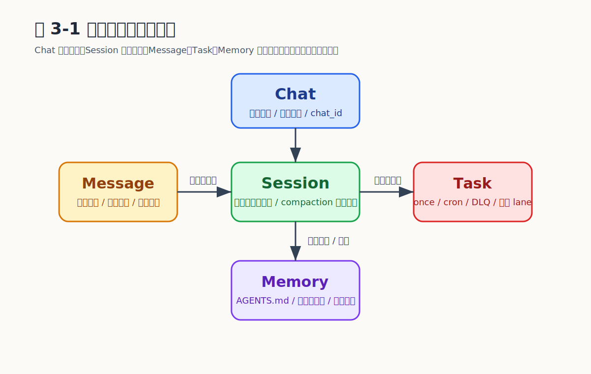

# Chapter 3 领域模型与数据流

## 系统里的核心对象是什么

第 2 章给出了模块分层。本章下沉一层，回答更基础的问题：运行时里到底有哪些关键实体，它们如何协作？

如果运行时只有一个"会话"对象，工程上很快会出现矛盾：聊天空间与推理状态被强行绑定、长期记忆和短期摘要分不清、调度任务找不到归属、subagent 的状态机和 Message 的语义对不上。MicroClaw 把领域拆成六个独立实体——Chat、Session、Message、Task、Memory、SubagentRun——每一个都有独立的状态空间与生命周期。

```
                        Chat
                     (外部归属)
                    ┌────┼────┐
                    │    │    │
                    ▼    ▼    ▼
              Message  Task  Memory
              (审计)  (调度) (长期事实)

         Chat ──── Session（可恢复推理状态）
                    │
                    ▼
              Agent Loop ──► SubagentRun
                             （委托执行）
                              │
                         parent_run_id
                         （树形嵌套）
```

## 实体一：Chat

Chat 是最外层对话容器，对应真实聊天空间——Telegram 私聊或群组、Discord 频道、Slack 线程、Web session、ACP session 等。它承载"这个上下文属于谁、来自哪里"，是 Message、Session、Task、Memory、SubagentRun 的归属锚点。15 个渠道再加 ACP 与 A2A，每一个都有自己原生的外部标识格式，Chat 把它们统一为内部 `chat_id`。

## 实体二：Session

Session 是 Agent Loop 的恢复对象。Chat 解决"对话属于哪个外部空间"，Session 解决"当前推理状态是什么"。

它包含当前消息上下文、压缩历史摘要、session label、thinking_level、verbose_level、reasoning_level，并支持 fork、tree view、compaction、reset——这些操作之所以成立，正是因为 Session 与 Chat 是两个独立的实体。

```rust
use serde::{Deserialize, Serialize};

#[derive(Debug, Clone, Serialize, Deserialize)]
struct Chat {
    id: i64,
    channel: String,
    chat_type: String,
}

#[derive(Debug, Clone, Serialize, Deserialize)]
struct SessionSettings {
    thinking_level: String,
    verbose_level: String,
    reasoning_level: String,
}

#[derive(Debug, Clone, Serialize, Deserialize)]
struct SessionState {
    chat_id: i64,
    label: Option<String>,
    summary: String,
    settings: SessionSettings,
    pending_tool_call: Option<String>,
}
```

## 实体三：Message

每条 `StoredMessage` 包含 id（UUID）、chat_id、sender_name、content、is_from_bot、timestamp。它承担四种角色：用户输入痕迹、助手输出痕迹、工具结果审计记录、系统事件表示。

Message 不是状态的全部——记忆事实库属于 Memory，调度定义属于 Task，subagent 执行记录属于 SubagentRun，可恢复推理状态属于 Session。把所有事情都塞进 Message 表，是新手最常见的领域建模错误。

v21 之后，`session_search` 表通过 SQLite FTS5 给历史消息建了全文索引，配套的 `session_search` 工具让 Agent 可以跨 chat 搜索过去的对话。

## 实体四：Task

Task 表示被调度、被追踪、可重试的工作单元。`scheduled_tasks` 表的核心字段：id、chat_id、prompt、schedule_type（cron/once）、schedule_value、timezone、next_run、last_run、status（active / paused / completed / cancelled）。配套的还有 `task_run_logs`（执行历史）和 `scheduled_task_dlq`（死信队列，支持 replay）。

围绕这一实体提供完整的工具族：`schedule_task`、`list_scheduled_tasks`、`pause_scheduled_task`、`resume_scheduled_task`、`cancel_scheduled_task`、`get_task_history`、`list_scheduled_task_dlq`、`replay_scheduled_task_dlq`。Agent 自己就能管理调度，无需绕回外部 cron。

## 实体五：Memory

双层设计是 MicroClaw 在记忆维度上的核心权衡——可读性与可检索性同时要。

| 层 | 载体 | 职责 | 操作工具 |
|----|------|------|---------|
| 文件记忆 | AGENTS.md（global / bot / chat 三级）+ SOUL.md（人格） | 可读、可编辑、可解释 | `read_memory`、`write_memory` |
| 结构化记忆 | `memories` 表（category / confidence / source / embedding / archived） | 可检索、可归档、可自动提取 | `structured_memory_search/delete/update` |

配套观测：`memory_reflector_runs`（提取统计）、`memory_injection_logs`（注入统计）、`memory_supersede_edges`（替代关系）、`MemoryObservabilitySummary`（聚合仪表盘）。`knowledge_graph` 工具在结构化层之上提供更高层次的事实关联视图，`insights` 工具基于这两层做趋势汇总。

## 实体六：SubagentRun

SubagentRun 让 MicroClaw 从"单 Agent 循环"升级为"session-native subagent 体系"。`subagent_runs` 表字段：run_id（UUID）、parent_run_id（嵌套）、depth、chat_id、task、status（queued / running / completed / failed / timeout / cancelled）、token_budget、provider、model、input_tokens、output_tokens、total_tokens、error_text、result_text、artifact_json、cancel_requested。

它必须是独立实体的四个理由：

1. **状态机**：queued → running → completed / failed / timeout / cancelled，远超 Message 的"发送/接收"语义
2. **资源约束**：token_budget 与 depth 是 SubagentRun 的固有属性，Message 没有这种属性
3. **嵌套关系**：parent_run_id 追踪父子关系，`subagents_orchestrate` 一次可以 spawn 多个
4. **独立 announce**：完成后通过 `subagent_announces` 表管理回调通知，支持重试

```rust
use serde::{Deserialize, Serialize};

#[derive(Debug, Clone, Copy, Serialize, Deserialize, PartialEq, Eq)]
#[serde(rename_all = "lowercase")]
enum SubagentStatus {
    Queued,
    Running,
    Completed,
    Failed,
    Timeout,
    Cancelled,
}

#[derive(Debug, Clone, Serialize, Deserialize)]
struct SubagentRun {
    run_id: String,
    parent_run_id: Option<String>,
    depth: i64,
    chat_id: i64,
    task: String,
    status: SubagentStatus,
    token_budget: i64,
    tokens_used: i64,
    artifact_json: Option<String>,
}
```

Subagent 工具族（`sessions_spawn` / `subagents_list` / `subagents_info` / `subagents_kill` / `subagents_focus` / `subagents_send` / `subagents_orchestrate`）所有动词都作用在这个实体上。`fetch_artifact` 用于把已完成 SubagentRun 留下的 artifact 取回主会话。

## 一次涉及 subagent 的数据流

```
用户消息 ──► Message 存储 ──► Session 恢复
                                │
                    Memory/SOUL 装载 ──► Agent Loop
                                          │
                         ┌────────────────┼────────────────┐
                    直接回答         调用工具(wave)     spawn subagent
                         │               │                 │
                         ▼               ▼                 ▼
                      Egress     工具结果回灌        SubagentRun(queued)
                                    │                      │
                                    ▼                 受限工具集
                              继续主循环              独立 token 预算
                                                          │
                                                      完成/失败
                                                          │
                                                  announce → Chat
                                                          │
                                                  持久化全部状态
```

## stop_reason 与失败路径

Agent 系统的稳定性，往往不取决于成功路径有多漂亮，而取决于失败路径是否被建模。

| 结束状态 | 后续行为 |
|---------|---------|
| `end_turn` | 正常持久化并发回 |
| 工具错误 | 错误信息回灌模型，由模型决定继续或结束 |
| 用户中断（/stop、Web abort、ACP cancel） | 设置 cancelled → 发出 `AgentEvent::Cancelled` → 终止 |
| 超时 | 工具级或 compaction 级超时 |
| 预算超限 | `max_tool_iterations` 或 SubagentRun 的 `token_budget` |
| Hook 阻止 | 拒绝理由通过 AgentEvent 传给用户 |
| Subagent 失败 | 主 Agent 收到结构化错误，可重试、报告或放弃 |

## 幂等与重试

Agent 系统天然容易触发重试。MicroClaw 的幂等手段分布在四个实体上：ChatTurnQueue（turn lock 防并发 run）、run_control（`ABORTED_SOURCE_MESSAGE_IDS` 防重复处理同一 source message）、SubagentRun（UUID run_id + announce 状态追踪）、scheduled_task_dlq（`replayed_at` 防止 replay 被反复触发）。

## 关键权衡

| 决策 | 收益 | 代价 |
|------|------|------|
| 六个独立实体而非一个大对象 | 职责边界清晰 | 跨表 join 增多 |
| Session 与 Chat 分离 | 支持 fork / tree / compaction / reset | 多一层抽象 |
| SubagentRun 独立实体 | 独立状态机、资源约束、嵌套、announce | schema 复杂（4 张表） |
| 双层记忆 | 人类运维与机器检索各有接口 | 需持续解释两层边界 |
| 失败路径纳入领域模型 | 恢复与重试有明确状态基础 | 每个实体的状态空间更大 |

## 容易走错的地方

**失败模式 1：把 Chat 与 Session 混为一谈**。无法解释"聊天还在但上下文已重置"，无法实现 fork / compaction / resume。

**失败模式 2：把 Message 当作全部事实来源**。无法做结构化恢复、记忆生命周期管理、subagent 状态追踪。

**失败模式 3：把 Memory 做成单层**。只保留文件记忆 → 检索弱；只保留结构化记忆 → 可读性差。

**失败模式 4：把 SubagentRun 当成"特殊的 Message"**。状态机、资源约束、announce 机制、嵌套关系全部丢失。

**失败模式 5：没有失败路径模型**。只定义成功路径，运行时很快失去一致性。

## 小结

六个实体各司其职：Chat（归属）、Session（恢复）、Message（审计）、Task（持续执行）、Memory（长期事实，双层）、SubagentRun（委托执行，含嵌套与 announce）。把这六个实体分清，数据流、恢复机制、失败处理才有解释力。

## 证据来源（v0.1.57）

- `crates/microclaw-storage/src/db.rs`（所有表定义；`SCHEMA_VERSION_CURRENT = 25`，v21 引入 FTS5 `session_search`）
- `src/agent_engine.rs`、`src/tool_executor.rs`、`src/memory_service.rs`、`src/memory_backend.rs`、`src/scheduler.rs`、`src/tools/subagents.rs`、`src/tools/session_search.rs`
- `src/config.rs`（`max_session_messages=40`、`subagent_max_spawn_depth=1`、`subagent_max_concurrent=4`）

## 图表清单

### 图 3-1：核心领域模型关系图


