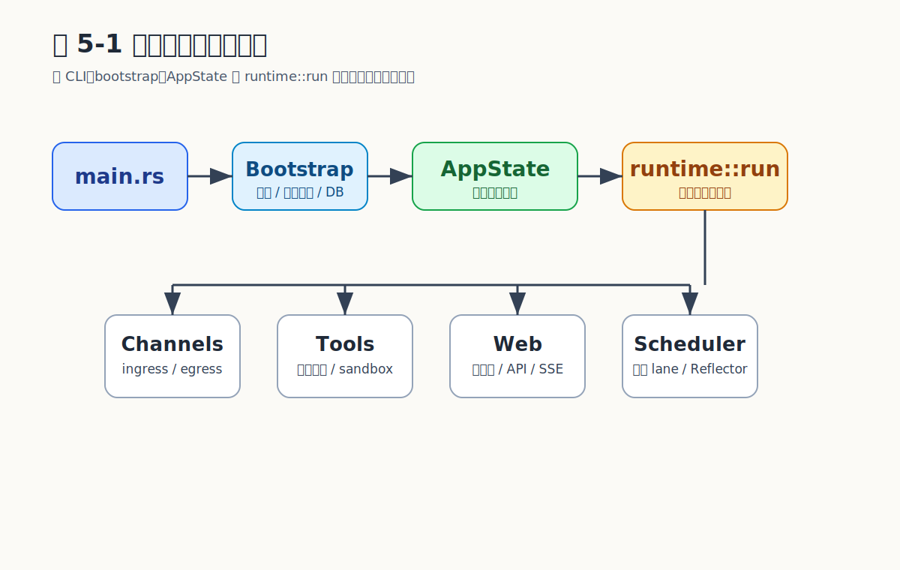

# Chapter 5 项目骨架与工程基线

## 为什么先治骨架

一个 agent 系统从 demo 走向生产，第一道关卡不是模型也不是工具，而是工程骨架是否承得住"渠道、工具、记忆、调度、可观测、诊断"同时存在。MicroClaw 选择单二进制 + workspace 多 crate 的形态：部署面尽量小（一个可执行文件），代码面则按契约切分（7 个 crate + 顶层编排）。

本章先讲这一选择的理由，再讲启动链如何把所有依赖组装成 `AppState`，最后给出工程基线（CLI 子命令、配置默认值、诊断/网关/向导）三件套的位置。

## Workspace 切分：7 个 crate 的职责边界

| Crate | 职责 | 关键类型 |
| --- | --- | --- |
| `microclaw-core` | 共享类型、错误语义 | `Message`、`ContentBlock`、`ToolDefinition` |
| `microclaw-storage` | 统一持久化 | `Database`、`Memory`、`KgTriple` |
| `microclaw-tools` | 工具运行时与风险/沙箱原语 | `Tool` trait、`ToolConcurrencyClass`、`SandboxRouter` |
| `microclaw-channels` | 渠道适配抽象 | `ChannelAdapter` trait、`ChannelRegistry` |
| `microclaw-clawhub` | 技能市场客户端 | ClawHub HTTP 客户端 |
| `microclaw-app` | 应用级辅助 | 内置 skills、日志初始化、语音转录 |
| `microclaw-observability` | OTLP 采集与导出 | `OtlpMetricExporter`、`OtlpTraceExporter`、`OtlpLogExporter` |
| 顶层 `src/` | 高层编排 | `AppState`、`agent_engine`、`runtime`、15 个渠道 |

依赖方向严格单向：`microclaw-tools` 不依赖 `agent_engine`，`microclaw-storage` 不依赖渠道层。这种切分让"运行时风险控制"、"持久化"、"渠道协议"、"高层调度"互不串味——后续把任何一块抽出做服务都不需要重写契约。

## 启动链：从命令行到 `AppState`

```
CLI 参数 → Config 加载/校验 → 数据目录准备 → 日志初始化
  → Database → MemoryManager → SkillManager → HookManager
    → runtime::run（AppState 装配 + 渠道启动 + 后台任务）
```

`Config::load()` 失败时自动启动 `setup::run_setup_wizard()`。`acp` 子命令（stdio）共享同一套准备链，仅最后入口不同——start/acp 共用准备链，是"渠道无关初始化"的具体落地。

```rust
struct Bootstrap<'a> {
    config: &'a Config,
}

impl<'a> Bootstrap<'a> {
    async fn prepare(&self) -> anyhow::Result<()> {
        ensure_data_dirs(self.config).await?;
        let db = Database::new(&self.config.runtime_data_dir())?;
        let memory = MemoryManager::new(&self.config.runtime_data_dir());
        let skills = SkillManager::from_skills_and_runtime(
            &self.config.skills_data_dir(),
            &self.config.runtime_data_dir(),
        );
        validate_config(self.config)?;
        Ok(())
    }
}
```

## CLI 子命令面：所有运行能力的入口

| 子命令 | 职责 |
| --- | --- |
| `start` | 启动启用的渠道（默认入口） |
| `acp` | 通过 stdio 提供 Agent Client Protocol 服务 |
| `setup` | 全屏向导，`Config::load()` 失败时自动回退 |
| `doctor` | 启动前预检（PATH、sandbox、MCP 依赖） |
| `gateway` | 系统服务化：install/start/stop/status/logs |
| `skill` | 管理 ClawHub 技能：search/install/list/inspect |
| `hooks` | 管理运行时 hook：list/info/enable/disable |
| `weixin` | 管理微信原生登录态 |
| `web` | 管理 Web UI 密码 |
| `reembed` | 重建活动记忆向量（需 `sqlite-vec` feature） |
| `upgrade` | 拉取最新 release |
| `version` | 显示版本号 |

子命令面表达产品立场：**运维能力（doctor/gateway/setup）从 Day 1 就是一等公民**，不是事后追加。

## `AppState`：单一事实源

```rust
pub struct AppState {
    pub config: Config,
    pub channel_registry: Arc<ChannelRegistry>,
    pub db: Arc<Database>,
    pub memory: MemoryManager,
    pub skills: SkillManager,
    pub hooks: Arc<HookManager>,
    pub llm: Box<dyn LlmProvider>,
    pub llm_provider_overrides: Arc<RwLock<HashMap<String, String>>>,
    pub llm_model_overrides: Arc<RwLock<HashMap<String, String>>>,
    pub embedding: Option<Arc<dyn EmbeddingProvider>>,
    pub memory_backend: Arc<MemoryBackend>,
    pub tools: ToolRegistry,
    pub chat_turn_queue: Arc<ChatTurnQueue>,
    pub skill_review_queue: SkillReviewQueue,
    pub metric_exporter: Option<Arc<OtlpMetricExporter>>,
    pub trace_exporter: Option<Arc<OtlpTraceExporter>>,
    pub log_exporter: Option<Arc<OtlpLogExporter>>,
}
```

| 字段 | 设计意图 |
| --- | --- |
| `chat_turn_queue` | 同一 chat 同时只有一个 agent run，多余排队 |
| `memory_backend` | 抽象本地 SQLite 与 MCP 外接，上层无感知 |
| `llm_provider_overrides` / `llm_model_overrides` | 不同渠道使用不同模型 |
| `tools` | 统一管理约 50 个内置工具 |
| `skill_review_queue` | 技能安装与审核异步流 |
| `hooks` | BeforeLLMCall / BeforeToolCall / AfterToolCall 注入点 |
| `metric/trace/log_exporter` | OTLP 三件套属于主链路，不是可选附件 |

`AppState` 本身不实现业务逻辑——它只承担"装配后，所有运行路径共享同一份资源句柄"。`runtime::run` 构造 `AppState` 后通过 `spawn_guarded` 启动各渠道：catch panic 让单渠道崩溃不拖垮其他渠道。

## 为什么是 Tokio + 单进程

Agent 系统的 I/O 形态以"等待 LLM、等待网络工具、等待用户"为主，CPU 占比小。Tokio 的多任务异步模型让一个进程同时跑 15 个渠道、几十个工具调用、后台 Reflector、调度器、OTLP 导出器，而不需要多进程协同。单进程也意味着 `AppState` 真的是单一事实源——chat turn 串行化只需一个 in-process queue，而非分布式锁。

代价是单进程内职责密集，所以 `spawn_guarded` 的 panic 隔离、`run_control` 的取消信号、`ChatTurnQueue` 的串行控制构成必备的运行时纪律。

## 配置默认值承载产品立场

| 配置项 | 默认值 | 含义 |
| --- | --- | --- |
| `max_tool_iterations` | 100 | 单次 agent 运行最大工具循环次数 |
| `max_session_messages` | 40 | 触发 compaction 的消息阈值 |
| `parallel_tool_max_concurrency` | 8 | 并行工具执行最大并发数 |
| `high_risk_tool_user_confirmation_required` | true | 高风险工具需用户确认 |
| `working_dir_isolation` | Chat | 工作目录隔离粒度 |
| `subagent_max_spawn_depth` | 1 | 子代理最大嵌套深度 |
| `reflector_interval_mins` | 15 | 记忆反射器运行间隔 |
| `memory_token_budget` | 1500 | 记忆注入 token 预算 |

默认值即产品立场：高风险确认默认开启 = 安全优先；Chat 级隔离 = 多会话天然不混淆；子代理深度上限 1 = 防递归失控。修改这些默认值意味着修改产品语义，需要明确的工程审查。

## 工程基线三件套

- **`doctor`**：启动前预检 PATH、sandbox 运行时、MCP 依赖。`microclaw doctor sandbox` 在容器运行时不可用时直接告警。
- **`setup`**：全屏向导，`Config::load()` 失败时自动回退（首次启动即可用）。
- **`gateway`**：系统服务化运行（systemd / launchd），`install/start/stop/status/logs`。

这三个能力不是 nice-to-have，而是 v0.1 就纳入主干——agent 系统的真正难题在"长期运行 + 跨机器部署 + 故障定位"，没有这三件就只能在终端里手动重启。

```{=typst}
#pagebreak(weak: true)
```

## 示例：`AppState` 装配的最小骨架

```rust
#[async_trait::async_trait]
trait LlmProvider: Send + Sync {
    async fn warm_up(&self) -> anyhow::Result<()>;
}

struct MinimalAppState {
    config: Config,
    db: Arc<Database>,
    llm: Box<dyn LlmProvider>,
    tools: ToolRegistry,
    chat_turn_queue: Arc<ChatTurnQueue>,
    memory_backend: Arc<MemoryBackend>,
    hooks: Arc<HookManager>,
}

impl MinimalAppState {
    async fn build(config: Config) -> anyhow::Result<Self> {
        let db = Arc::new(Database::new(&config.runtime_data_dir())?);
        let memory_backend = Arc::new(MemoryBackend::local_only(db.clone()));
        let channel_registry = Arc::new(ChannelRegistry::default());
        let tools = ToolRegistry::new(
            &config,
            channel_registry.clone(),
            db.clone(),
            memory_backend.clone(),
        );
        Ok(Self {
            llm: create_llm_provider(&config)?,
            chat_turn_queue: Arc::new(ChatTurnQueue::new(
                config.chat_turn_queue_max_pending,
            )),
            hooks: Arc::new(HookManager::load(&config)?),
            config,
            db,
            memory_backend,
            tools,
        })
    }

    async fn warm_up(&self) -> anyhow::Result<()> {
        self.db.ping().await?;
        self.llm.warm_up().await?;
        self.tools.self_check().await?;
        Ok(())
    }
}
```

骨架三件事：构造按依赖拓扑（`db → memory_backend → tools`）；所有共享句柄走 `Arc`；启动后调一次 `warm_up`，让"延迟暴露的故障"在主循环之前先报错。

## 关键权衡

| 决策 | 优点 | 代价 |
| --- | --- | --- |
| 单二进制启动路径 | 部署简单、状态集中 | 单进程内职责多，需 `spawn_guarded` 隔离 |
| Workspace 拆 crate 而非拆服务 | 先治代码复杂度，再决定是否服务化 | crate 接口设计需更自觉 |
| `AppState` 作为唯一资源装配点 | 无重复初始化、无隐式全局 | 字段数量随能力线性增长 |
| 默认值承载产品立场 | 上手顺滑、更安全 | 默认值改动 = 产品语义改动 |
| `doctor`/`setup`/`gateway` 纳入主干 | 运维能力 Day 1 就在 | 前期需投入更多非功能工作 |

## 容易走错的地方

1. **把骨架理解成目录美化**。crate 之间依赖方向的单向性才是工程价值；模仿目录布局却让 crate 互相 import，比单文件还糟。
2. **每个模块自行初始化依赖**。`start` 与 `acp` 共享同一套初始化链就是正面案例：依赖图只有一份，不会出现"渠道版本"和"acp 版本"两套行为。
3. **只做功能不做诊断**。`doctor` 在启动前告诉你 sandbox 是否可用，比运行时 bash 工具失败再排查省一个数量级时间。
4. **忽视遗留布局迁移**。`migrate_legacy_runtime_layout` 保证跨版本升级数据不丢——升级路径是工程基线的一部分。

## 小结

MicroClaw 把运行时装配、状态存储、并发控制、风险治理、可观测、诊断、升级在 v0.1 阶段固化。7 个 crate 让核心契约可被严格管理，`AppState` 让所有路径共享同一份资源，CLI 子命令面让运维能力从一开始就存在。这套骨架不是为了好看，而是让后续每个新增能力都可以在已有契约上挂载，而不需要回头修地基。

## 证据来源（v0.1.57）

`src/main.rs`、`src/runtime.rs`（801 行）、`src/config.rs`、`crates/microclaw-core`、`crates/microclaw-storage/src/db.rs`、`crates/microclaw-tools/src/runtime.rs`、`crates/microclaw-channels/src/channel_adapter.rs`

## 图表清单

### 图 5-1：启动链与统一装配图


