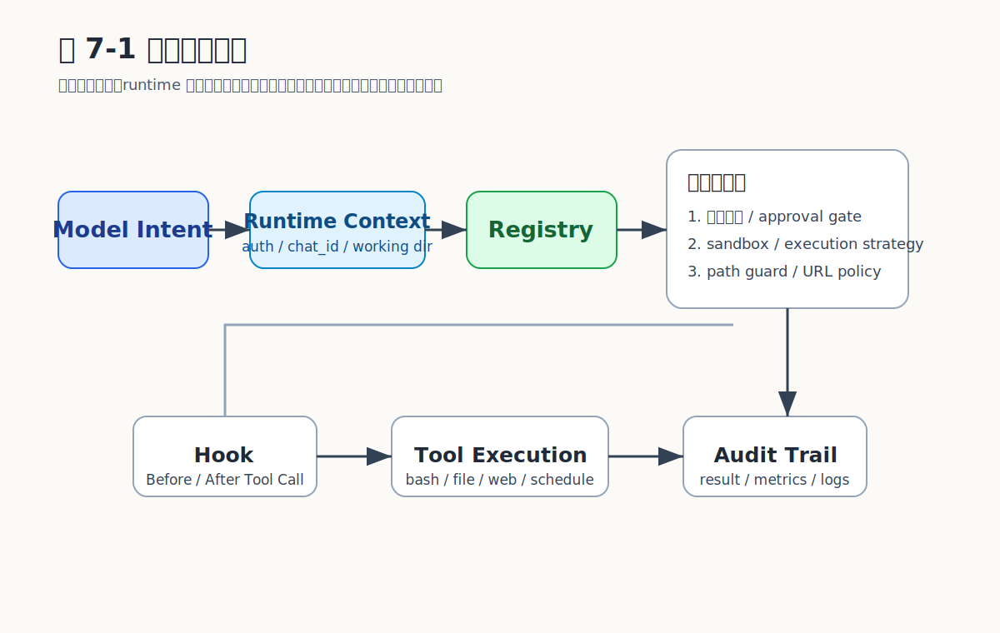

# Chapter 7 工具系统

## 工具系统的真正难题

模型能调用工具早已不是新鲜事。真正的难题在于：**工具能否被安全地、可观测地、可治理地批量执行**。每个新工具都引入新的副作用面、新的权限边界、新的失败模式；如果只是把工具当函数注册进去，几十个工具叠在一起就是失控的开始。

MicroClaw 的工具系统由四个层次组成：`Tool` trait（接口）→ `ToolRegistry`（治理入口）→ `tool_executor` 的 wave 调度（并发安全）→ Hook 三事件（可插拔策略）。本章顺着这条链路展开。

## 约 50 个内置工具的全景

| 功能域 | 代表工具 | 主要并发类 |
| --- | --- | --- |
| 文件（5） | `read_file` `glob` `grep` / `write_file` `edit_file` | ReadOnly / SideEffect |
| 命令（1） | `bash`（120s 超时，sandbox 路由） | Exclusive，高风险 |
| 网络（2） | `web_fetch` `web_search` | ReadOnly |
| 浏览器（1） | `browser` | ReadOnly |
| 记忆（5） | `read_memory` `write_memory` `structured_memory_search/update/delete` | 混合 |
| 知识图谱（2） | `knowledge_graph_query` `knowledge_graph_add` | ReadOnly / SideEffect |
| 调度（8） | `schedule_task` `list_scheduled_tasks` `pause_scheduled_task` `resume_scheduled_task` `cancel_scheduled_task` `get_task_history` `list_scheduled_task_dlq` `replay_scheduled_task_dlq` | 混合 |
| 协作（4） | `export_chat` `todo_read` / `send_message`（连续 3 次阻断） `todo_write` | 混合 |
| 子代理（11） | `subagents_list/info/focused/log` / `kill/focus/unfocus/send/orchestrate/retry_announces` / `sessions_spawn` | 混合 + Exclusive |
| 时间数学（3） | `get_current_time` `compare_time` `calculate` | ReadOnly |
| 技能（3） | `activate_skill` `skill_manage` `sync_skills` | Exclusive / SideEffect |
| 多模态（4） | `describe_image` `generate_image` `text_to_speech` `transcribe_audio` | 混合 |
| 安全/检查（2） | `osv_check` `clarify` | ReadOnly / SideEffect |
| 协议互通（2） | `a2a_list_peers` `a2a_send` | ReadOnly / SideEffect |
| 检索（3） | `session_search` `fetch_artifact` `insights` | ReadOnly |

文件操作支持 `working_dir_isolation`（默认 Chat 级隔离）；`bash` 走 `SandboxRouter`，按配置在宿主机或容器中执行。

## `Tool` 抽象

`Tool` trait 定义在 `crates/microclaw-tools/src/runtime.rs`：

```rust
pub struct ToolSpec {
    pub name: String,
    pub description: String,
    pub input_schema: serde_json::Value,
}

#[async_trait::async_trait]
pub trait Tool: Send + Sync {
    fn spec(&self) -> ToolSpec;
    async fn execute(&self, input: serde_json::Value) -> ToolResult;
}
```

工具只暴露三件事：自描述（`spec`）、执行入口（`execute`）、Send + Sync（多任务可调度）。所有授权、并发、超时、审计都在 `ToolRegistry` 这一层统一处理，工具实现专注业务。

## `ToolRegistry`：治理入口

`ToolRegistry`（`src/tools/mod.rs`）承担四件事：

### 1. 自动注入 chat_id

模型不能被信任来声明权限边界。`inject_default_chat_id_if_missing` 对一组涉及权限的工具（`write_memory` / `read_memory` / `todo_*` / `send_message` / `sessions_spawn` / 各种 `subagents_*`）在 `chat_id` 缺失时从运行时事实补齐：

```rust
fn inject_default_chat_id_if_missing(
    tool_name: &str,
    input: serde_json::Value,
    auth: &ToolAuthContext,
) -> serde_json::Value {
    if !Self::should_inject_default_chat_id(tool_name) { return input; }
    let mut obj = match input {
        serde_json::Value::Object(map) => map,
        _ => serde_json::Map::new(),
    };
    if obj.get("chat_id").and_then(|v| v.as_i64()).is_none() {
        obj.insert("chat_id".into(),
            serde_json::Value::Number(auth.caller_chat_id.into()));
    }
    serde_json::Value::Object(obj)
}
```

### 2. 授权上下文注入

`ToolAuthContext { caller_channel, caller_chat_id, control_chat_ids }` 通过 `inject_auth_context` 写入输入的 `__microclaw_auth` 字段。工具内部用 `auth_context_from_input` 取出，权限判定基于运行时事实而非模型自述。

### 3. Sandbox 路由

`SandboxRouter` 决定具体工具在宿主机还是容器中执行，管理安全 profile 与额外挂载（如 `skills_data_dir`）。`bash` 默认走 dual policy（host + sandbox 都可），`write_file` / `edit_file` 强制 host-only。

### 4. 子代理受限工具集

`ToolRegistry::new_sub_agent(...)` 构造一个**受限**的工具集合：去掉 `write_memory`、`send_message`、`schedule_*`、`structured_memory_update/delete` 等带副作用、能跨会话扩散的工具。子代理是个"只读/沙箱内"的探索者，不应该有写主记忆、向用户发消息、安排定时任务的能力——否则递归生成的子代理会失控。

子代理的运行时元数据走另一个字段 `__subagent_runtime`：`{ depth, token_budget_remaining, runtime: "native"|"acp", runtime_target }`。这与授权上下文 `__microclaw_auth` 是两条独立的注入通道。

## 风险分级与高风险确认

```rust
pub enum ToolRisk {
    Low,
    Medium,
    High,
}

pub fn tool_risk(name: &str) -> ToolRisk {
    match name {
        "bash" => ToolRisk::High,
        "write_memory"
        | "structured_memory_update"
        | "pause_scheduled_task"
        | "cancel_scheduled_task" => ToolRisk::Medium,
        _ => ToolRisk::Low,
    }
}
```

三级分类各有用途：`High` 用于不可逆或对宿主机有直接影响的操作（`bash`），在 `high_risk_tool_user_confirmation_required=true`（默认）下需向用户索要明确确认；`Medium` 标注会修改长期状态但仍在内核可控范围内的操作（写入记忆、暂停或取消调度任务）；`Low` 是只读或纯计算工具，默认无确认门。Web 渠道与 control chat 的高风险默认走人工审批通道（见 `tools/mod.rs` 中 `requires_approval()` 的实现）。

## Wave-Based 并行执行

### 三级并发分类

```rust
pub enum ToolConcurrencyClass {
    ReadOnly,    // 可与其他 ReadOnly 并行
    SideEffect,  // 必须与其他 SideEffect/Exclusive 串行
    Exclusive,   // 必须独占执行
}
```

| 维度 | ReadOnly | SideEffect | Exclusive |
| --- | --- | --- | --- |
| 同 wave 并行多个 | 是 | 否，每个独占一 wave | 否，每个独占一 wave |
| 是否修改外部状态 | 否 | 是（文件/记忆/网络副作用） | 是（且不可预测，如 bash） |
| 典型工具 | `read_file` `grep` `web_fetch` `web_search` `read_memory` | `write_file` `edit_file` `write_memory` `send_message` `schedule_task` | `bash` `activate_skill` `sessions_spawn` |
| 失败影响面 | 仅当前调用 | 当前调用 + 后续依赖 | 全 chat 状态可能变化 |

未知工具与 `mcp_*` 默认归 SideEffect（保守策略）；用户可通过 `tool_concurrency_overrides` 配置覆盖。

### Wave 调度算法

```
模型返回多个 tool_use → 按 concurrency class 分区：
  Wave 1: [所有 ReadOnly]    ── 并行执行（受 parallel_tool_max_concurrency=8 限制）
  Wave 2: [SideEffect #1]   ── 单独一个 wave
  Wave 3: [SideEffect #2]   ── 单独一个 wave
  Wave N: [Exclusive #1]    ── 独占
```

例：`read_file` + `grep` + `web_fetch` + `write_file` + `bash` →
- Wave 1 并行：`read_file`、`grep`、`web_fetch`
- Wave 2：`write_file`
- Wave 3：`bash`

最终结果按原始 index 排序写回，对模型呈现的顺序与请求顺序一致。这种分区让"读取并行、写入串行、高危独占"成为默认行为，无需工具自行判断。

### 单工具执行链路

```
名字检查 → send_message 连续 3 次阻断 → BeforeToolCall hook
  → ToolStart 事件 → tool.execute → OTLP trace
    → approval_required 自动重试 → activate_skill metadata
      → AfterToolCall hook → ToolResult 事件 → 更新错误跟踪 / 重复指纹
```

每个环节都可被中止：hook 返回 `Block` 即终止；用户取消即抛 `Cancelled` 事件并不再执行后续 wave。

## 重复调用抑制

防失控的关键不是迭代上限，而是**对"机械重试"的快速止损**。`tool_cache::cache_key(name, input)` 对工具名 + 归一化输入做指纹，连续 6 次完全相同即判定失控并立即中止：

```rust
fn fingerprint(call: &ToolCall) -> String {
    microclaw_tools::tool_cache::cache_key(&call.name, &call.input)
}
```

归一化包括：JSON 字段排序、字符串 trim、数字规范化——避免空白差异让指纹失效。

## Hook：可插拔治理层

| 事件 | 能力 |
| --- | --- |
| `BeforeLLMCall` | block 请求或修改 system prompt |
| `BeforeToolCall` | block 工具调用或修改输入 |
| `AfterToolCall` | block 结果（标记错误）或修改 output |

`HookOutcome = Allow { patches } | Block { reason }`。Hook 适合承载**部署级策略**——风险摘要、临时禁用工具、敏感信息脱敏、组织合规——而不污染工具实现。例如某团队规定 `bash` 命令必须经过 PR review，可以在 `BeforeToolCall` 写一个 hook block 掉所有非 allowlist 命令，无需改 `bash.rs`。

```{=typst}
#pagebreak(weak: true)
```

## 示例：wave 分区与并行批执行

```rust
#[derive(Clone, Copy, PartialEq)]
enum ConcurrencyClass {
    ReadOnly,
    SideEffect,
    Exclusive,
}

fn partition_into_waves(
    calls: &[ToolCall],
    classify: impl Fn(&str) -> ConcurrencyClass,
) -> Vec<Vec<usize>> {
    let mut readonly = Vec::new();
    let mut side_effect = Vec::new();
    let mut exclusive = Vec::new();
    for (i, call) in calls.iter().enumerate() {
        match classify(&call.name) {
            ConcurrencyClass::ReadOnly => readonly.push(i),
            ConcurrencyClass::SideEffect => side_effect.push(i),
            ConcurrencyClass::Exclusive => exclusive.push(i),
        }
    }
    let mut waves = Vec::new();
    if !readonly.is_empty() { waves.push(readonly); }
    for idx in side_effect { waves.push(vec![idx]); }
    for idx in exclusive { waves.push(vec![idx]); }
    waves
}

async fn execute_batch(
    tools: &ToolRegistry,
    calls: &[ToolCall],
) -> Vec<ToolResult> {
    let waves = partition_into_waves(calls, |name| tool_concurrency_class(name));
    let mut all_results: Vec<(usize, ToolResult)> = Vec::new();
    for wave in &waves {
        if wave.len() == 1 {
            let r = tools.execute(&calls[wave[0]]).await;
            all_results.push((wave[0], r));
        } else {
            let mut join_set = tokio::task::JoinSet::new();
            for &idx in wave {
                let call = calls[idx].clone();
                let tools = tools.clone();
                join_set.spawn(async move {
                    (idx, tools.execute(&call).await)
                });
            }
            while let Some(Ok(item)) = join_set.join_next().await {
                all_results.push(item);
            }
        }
    }
    all_results.sort_by_key(|(idx, _)| *idx);
    all_results.into_iter().map(|(_, r)| r).collect()
}
```

要点：分区按 class 三桶；ReadOnly 桶可并发；SideEffect / Exclusive 各占一 wave；最后按原 index 排序还给模型。

## 关键权衡

| 决策 | 优点 | 代价 |
| --- | --- | --- |
| Wave 分区按 class | 默认安全、可推理 | 无法做更细粒度依赖分析 |
| Concurrency class 硬编码 + 可覆盖 | 默认安全 | 新工具需手动添加分类 |
| 风险三级（Low/Medium/High）| 边界清晰，确认门只挂在 High | Medium 与 Low 的实际差别需靠文档维护 |
| 授权由 runtime 注入 | 权限可信 | 工具接口稍复杂 |
| 子代理受限工具集 | 防递归失控 | 子代理能力受限 |
| Hook 承载部署级策略 | 不污染工具实现 | Hook 自身需文档化与故障隔离 |

## 容易走错的地方

1. **把工具当简单函数调用**。忽视 schema 校验、审计、权限注入、超时、concurrency class、hook——任何一个都会在生产暴露。
2. **相信模型参数可信**。模型生成的 `chat_id`、文件路径不应直接当事实。`inject_default_chat_id_if_missing` 与 `authorize_chat_access` 存在的意义就在这。
3. **忽视并行正确性**。把所有工具标为 ReadOnly → `write_file` 与 `bash` 并发执行 → 文件损坏。`tool_concurrency_class` 的"未知归 SideEffect"是必要的保守。
4. **把 sandbox 当唯一安全手段**。没有审批、路径隔离、授权、Hook，sandbox 仍留大量盲区。安全是分层的。
5. **子代理共享主代理工具集**。直接把 `ToolRegistry` 给子代理 → 递归调用 `sessions_spawn` 炸出指数级孙代理。

## 小结

工具系统把约 50 个工具治理成统一授权、并行执行、审批隔离、审计完整、策略可扩展的能力层。`Tool` trait 封装"做什么"，`ToolRegistry` 治理"谁能做、怎么做、做完报告"，wave 调度让"读取并行、写入串行、高危独占"成为可编程策略，Hook 承载部署级合规。子代理的受限工具集与重复调用抑制是防失控的两条最具杠杆的设计。

## 证据来源（v0.1.57）

`src/tools/mod.rs`、`src/tool_executor.rs`（990 行）、`crates/microclaw-tools/src/runtime.rs`、`crates/microclaw-tools/src/tool_cache.rs`、`src/hooks.rs`。关键配置：`parallel_tool_max_concurrency=8`、`working_dir_isolation=Chat`、`high_risk_tool_user_confirmation_required=true`。

## 图表清单

### 图 7-1：工具治理链路


