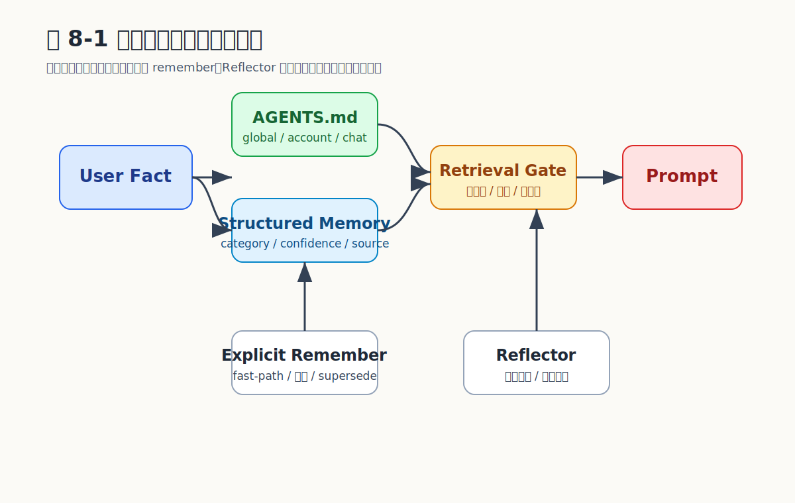

# Chapter 8 记忆系统

## Agent 怎样才能不每次都从零开始

让 agent "记得"用户偏好、长期事实、任务进度，看似只是把对话存下来再读出来——真正的工程难点在于：什么该记、什么不该记，怎么不被错误信息污染，怎么在 token 预算内召回最有用的，怎么让用户能直接编辑而不依赖 agent 自身。

MicroClaw 把记忆系统做成**双层架构**：文件记忆（`AGENTS.md` / `SOUL.md`）解决可读与可编辑，结构化记忆（SQLite + 可选 `sqlite-vec`）解决检索与生命周期。`MemoryBackend` 抽象本地与 MCP 外接两种后端；Reflector 负责自动积累；`memory_quality` 提供质量门控；`should_skip_memory_poisoning_risk` 防止"错误行为被当事实"形成自我强化的偏差。

## 第一层：文件记忆

`MemoryManager` 通过 `build_memory_context` 按作用域装载文件记忆：

| 作用域 | 文件位置 | 用途 |
| --- | --- | --- |
| 全局 | `~/.microclaw/AGENTS.md` / `SOUL.md` | 团队约定、风格要求 |
| Account / Bot | per-channel 配置路径 | 单账号专属规则 |
| Chat | `runtime/groups/{chat_id}/AGENTS.md` | 单会话覆盖 |

文件记忆适合放**高层规则与稳定背景**（团队约定、工作目录、风格要求）。优势：人类直接编辑、天然可审计、版本可控（git）。劣势：难以做细粒度检索，不适合大量短事实。

```rust
#[derive(Debug, Clone, Copy)]
enum MemoryScope { Global, Account, Chat }

#[async_trait::async_trait]
trait MemoryLoader {
    async fn load_scope(&self, scope: MemoryScope, chat_id: i64)
        -> anyhow::Result<Vec<String>>;
}
```

## 第二层：结构化记忆

`Memory` 结构（`crates/microclaw-storage/src/db.rs`）含完整元数据：

```rust
pub struct Memory {
    pub id: i64,
    pub chat_id: Option<i64>,        // null = 全局
    pub content: String,
    pub category: String,             // PROFILE / KNOWLEDGE / EVENT
    pub created_at: String,
    pub updated_at: String,
    pub last_seen_at: String,
    pub embedding_model: Option<String>,
    pub confidence: f64,              // 默认 0.70
    pub source: String,               // 默认 'legacy'，显式写入='explicit'
    pub is_archived: bool,
    pub archived_at: Option<String>,
    pub expires_at: Option<String>,   // RFC3339 TTL，NULL = 永久
}
```

伴随的辅助表：

| 表 | 用途 |
| --- | --- |
| `memory_reflector_state` | Reflector 进度游标（每 chat） |
| `memory_reflector_runs` | 每次 Reflector 运行的输入输出统计 |
| `memory_injection_logs` | 每次注入的检索方法、候选数、被选数、token 用量 |
| `knowledge_graph` | 时序三元组（`subject/predicate/object/valid_from/valid_to/confidence/source/source_memory_id`） |

`MemoryBackend` 默认 `local_only`（SQLite），也支持 MCP 外接。三个核心接口：`get_memories_for_context`、`insert_memory_with_metadata`、`supersede_memory`。上层（Reflector、显式记忆、检索注入）无需关心后端选择。

## 双层为什么必要

| 维度 | 文件（AGENTS.md / SOUL.md） | 结构化（SQLite） |
| --- | --- | --- |
| 适合内容 | 声明性规则、稳定背景 | 事实性增量、对话积累 |
| 维护方式 | 人类直接编辑 | Agent / Reflector 自动管理 |
| 检索方式 | 按作用域全量装载 | 关键词 / KNN 相关性排序 |
| 生命周期 | 手动维护 | confidence、archive、supersede、TTL |
| 审计 | git 历史 | `memory_injection_logs` |

把高层规则塞结构化表会丢失"人类可直接编辑"的可读性；把对话事实塞文件会让记忆膨胀且无法精排。两层各自承担合适的边界。

## 显式记忆 fast-path

进入主循环前先检测"记住 X" / "remember X"：

```
内容提取 → 质量检查 → Jaccard 去重（阈值 0.55）
  → topic 冲突走 supersede → 写入（confidence=0.95, source="explicit"）
    → 生成 embedding（如启用）→ 跳过 agent loop
```

显式意图本身已是结构化语义，让 LLM "自由发挥"反而引入失败面（误解、写垃圾、生成多余对话）。结构化处理可靠且省成本。

## 检索注入

`build_db_memory_context` 按三条路径检索：

```
sqlite-vec + embedding 可用？ ──是──→ KNN 语义检索
       │
       否 → 关键词打分（支持 CJK bigram）
```

**Token 预算**：`memory_token_budget`（默认 1500），按每 4 字符 ≈ 1 token 逐条累加，超预算停止。

注入格式：
```xml
<structured_memories>
[KNOWLEDGE] [chat] User prefers concise responses
[PROFILE] [global] Team uses TypeScript for frontend
(+3 memories omitted)
</structured_memories>
```

**注入审计**：每次记录 `retrieval_method`、`candidate_count`、`selected_count`、`omitted`、`used_tokens` 到 `memory_injection_logs`。没有审计就无法调优检索策略——你不知道注入了什么、漏了什么、被截断了什么。

## TTL（`expires_at`）vs Archive 的区别

| 机制 | 字段 | 用途 |
| --- | --- | --- |
| 归档 | `is_archived` + `archived_at` | "曾经为真但被 supersede"。保留历史，不参与检索 |
| 过期 | `expires_at` | "本就有时效"。到期由 Reflector 主动剪枝，等同于"应该忘掉" |

例：用户说"我下周一去出差" → `expires_at = next_monday + 1d`。Reflector 周期跑过期清理；归档则只在 supersede 时触发。两者职责不重叠。

## 可选 `sqlite-vec`：增强而非依赖

`sqlite-vec` 是可选 feature。启用时：启动创建向量索引 → 优先 KNN 检索 → 写入时自动 embedding → `microclaw reembed` 命令批量重建。未启用时退化到关键词打分（CJK bigram），系统完全正常工作。

设计取舍：先把结构化治理做好（confidence、archive、supersede、审计），再加语义增强。如果 Reflector 毒性过滤没做、TTL 没定、审计不存在，向量召回出来的全是低质量记忆，反而强化噪音。

## 知识图谱：时序三元组

`knowledge_graph` 表存 `(subject, predicate, object)` 三元组，附带 `valid_from` / `valid_to` 表达"何时为真"。例：`(user, prefers, "TypeScript", 2024-03-01, NULL)` 表示从 2024-03 起一直成立；若用户后来改用 Python，则把 `valid_to` 设为切换时刻并新增一条。`source_memory_id` 关联回原记忆，让图谱可追溯。

工具：`knowledge_graph_query`（按 subject/predicate/时间范围检索）、`knowledge_graph_add`（写入新三元组）。这条线让"长期事实演化"可推理，而不只是"当前快照"。

## Reflector：自动提取记忆

后台周期运行（默认 15 分钟），读取最近对话调 LLM 提取结构化记忆。`apply_reflector_extractions` 执行完整质量门控：

```
JSON 解析 → 类别校验 → 内容标准化（截断 180 字符）→ 毒性检测
  → 质量检查 → Supersede 处理 → Topic 冲突 → 去重（Jaccard ≥ 0.85）→ 合并决策
```

**毒性检测**：`should_skip_memory_poisoning_risk` 过滤"把错误行为描述成事实"的记忆，例如 `"tool calls were broken"`、`"the agent failed"`——这类描述若被当事实长期注入，agent 会不断强化"我做不到"的偏差。但保留**纠正性行动项**（以 `TODO:` 开头或含 `ensure`），因为这是改进信号而非错误事实。

## 生命周期管理

| 操作 | 接口 |
| --- | --- |
| 更新 | `update_memory_with_metadata` |
| Supersede | 归档旧记忆 + 创建新记忆，保留关联 |
| 归档 | `is_archived=true` |
| 删除 | `structured_memory_delete` 工具 |
| TTL 剪枝 | Reflector 周期清 `expires_at < now` |
| 命中刷新 | 注入时更新 `last_seen_at` |

Agent 通过 `structured_memory_search/update/delete` 主动管理记忆。

```{=typst}
#pagebreak(weak: true)
```

## 示例：显式 remember 的受控写入

```rust
#[async_trait::async_trait]
trait MemoryStore {
    async fn insert_memory(
        &self,
        chat_id: Option<i64>,
        content: &str,
        category: &str,
        confidence: f64,
        source: &str,
        expires_at: Option<&str>,
    ) -> anyhow::Result<i64>;

    async fn update_memory(&self, memory_id: i64, content: &str)
        -> anyhow::Result<()>;

    async fn find_similar(&self, chat_id: Option<i64>, content: &str, threshold: f64)
        -> anyhow::Result<Option<i64>>;
}

struct ExplicitMemoryWriter<S> { store: S }

impl<S: MemoryStore> ExplicitMemoryWriter<S> {
    async fn remember(
        &self,
        chat_id: i64,
        content: &str,
        ttl: Option<&str>,
    ) -> anyhow::Result<String> {
        if !memory_quality_ok(content) {
            return Ok("Skipped: content too vague.".into());
        }
        if should_skip_memory_poisoning_risk(content) {
            return Ok("Skipped: potential poisoning content.".into());
        }
        if let Some(existing_id) = self
            .store
            .find_similar(Some(chat_id), content, 0.55)
            .await?
        {
            self.store.update_memory(existing_id, content).await?;
            return Ok(format!("Updated memory #{existing_id}"));
        }
        let id = self
            .store
            .insert_memory(
                Some(chat_id),
                content,
                "KNOWLEDGE",
                0.95,
                "explicit",
                ttl,
            )
            .await?;
        Ok(format!("Saved memory #{id}"))
    }
}
```

要点：质量检查 + 毒性过滤 + Jaccard 去重 + 高置信度（0.95）写入 + 可选 TTL。每一步都不可省略——否则结构化记忆很快就会变成无监督日志。

## 关键权衡

| 决策 | 优点 | 代价 |
| --- | --- | --- |
| 文件 + 结构化双层 | 兼顾可编辑与可检索 | 需向用户解释职责边界 |
| `MemoryBackend` 支持 MCP | 可演进到外部服务 | 需保持行为一致 |
| 显式记忆 fast-path | 可靠、可预测、省 LLM | 维护一条非通用路径 |
| Reflector 默认开启 + 多层门控 | 自动积累事实 | 门控逻辑需持续维护 |
| 向量检索为增强非强依赖 | 启动简单、默认稳定 | 纯本地语义召回有限 |
| TTL 与 Archive 分离 | 语义清晰 | 两套清理逻辑各自维护 |
| 知识图谱时序三元组 | 长期事实演化可推理 | 写入与维护成本上升 |

## 容易走错的地方

1. **所有信息塞 `AGENTS.md`**。文件适合少量高层规则，不适合大量细粒度事实。文件膨胀到几十 KB 就是失控信号。
2. **结构化记忆当无上限日志**。没有 confidence、archive、supersede，旧事实会不断稀释新事实。
3. **自动提取忽视污染风险**。错误行为写成长期事实 → agent 自我强化偏差。`should_skip_memory_poisoning_risk` 不是可选项。
4. **没有注入审计就调优检索**。不知道注入了多少、截断了多少，无法判断记忆是否帮助了模型。`memory_injection_logs` 是调优的前置条件。
5. **过早依赖 embedding**。先把结构化治理做扎实，再加语义增强；反过来会让低质量记忆因相似度高被反复召回。
6. **TTL 与 Archive 混用**。把"过期"写成"归档"会让历史可推理性丢失；把"被替代"写成"过期"会让 supersede 链条断裂。

## 小结

记忆系统把记忆做成**可编辑、可检索、可观测、可归档、可纠错**的双层系统。文件记忆承载稳定规则，结构化记忆承载事实增量；`sqlite-vec` 作为可选增强；知识图谱让长期事实演化可推理；毒性检测与质量门控确保自动提取不成为污染源。每一层都有明确的权责边界与审计入口，是 agent 走向长期运行的必要基础设施。

## 证据来源（v0.1.57）

- `src/memory_service.rs`、`src/memory_backend.rs`、`crates/microclaw-storage/src/db.rs`、`crates/microclaw-storage/src/memory_quality.rs`
- `src/tools/memory.rs`、`src/tools/structured_memory.rs`、`src/tools/knowledge_graph.rs`
- 关键配置：`memory_token_budget=1500`、`reflector_enabled=true`、`reflector_interval_mins=15`

## 图表清单

### 图 8-1：记忆生命周期与注入路径


