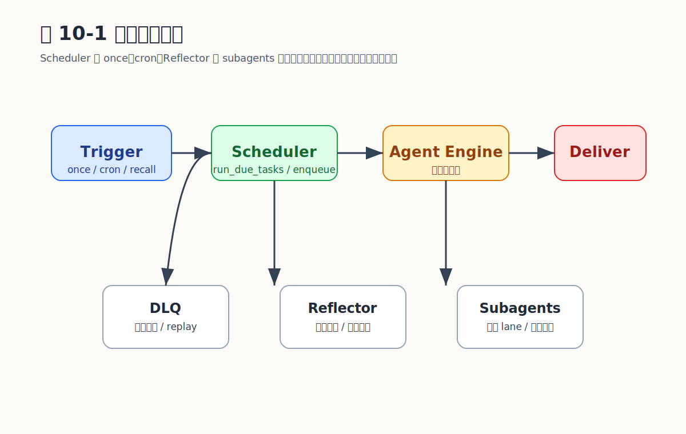

# Chapter 10 调度与后台任务

## 这一章要回答什么问题

Agent 如何从"收到消息才回答"升级为"具备时间维度的执行体"——定时提醒、周期汇总、记忆抽取、子代理并行编排，全部在重启可恢复的前提下进行？

## 后台四条 Lane

`microclaw` 把异步执行收敛到四条互不耦合的车道：Scheduler、Reflector、Subagents、Announce Relay。它们都遵守同一组纪律：状态持久化、可取消、与统一对话循环共享 `process_with_agent`。

| Lane | 触发方式 | 持久化 | 可取消 | 结果回传 |
|------|---------|--------|--------|---------|
| Scheduler | 时间驱动（cron/once） | `scheduled_tasks` + `task_run_logs` | 删除/暂停任务 | 经渠道投递回 chat |
| Reflector | 周期驱动 | cursor 表 | config 禁用 | 写入记忆系统 |
| Subagents | 工作驱动（spawn） | `subagent_runs` | kill + cancel flag | announce 回传 |
| Announce Relay | 周期驱动 | pending state | 自动 | 渠道投递 |

## Scheduler 主循环：与 wall-clock 对齐

`src/scheduler.rs` 一千多行的核心是这样一段循环：

```rust
let now = Utc::now();
let secs_into_minute = now.timestamp().rem_euclid(60) as u64;
let nanos = now.timestamp_subsec_nanos() as u64;
let mut delay = Duration::from_secs(60 - secs_into_minute);
if secs_into_minute == 0 { delay = Duration::from_secs(60); }
delay = delay.saturating_sub(Duration::from_nanos(nanos));

let mut ticker = tokio::time::interval_at(Instant::now() + delay, Duration::from_secs(60));
ticker.set_missed_tick_behavior(MissedTickBehavior::Skip);
loop {
    ticker.tick().await;
    run_due_tasks(&state).await;
}
```

四个关键决策：

1. **启动恢复**：先调用 `recover_running_tasks` 把上次进程异常退出时停留在 `running` 的任务恢复成可重跑状态。
2. **立即跑一轮**：进入 ticker 之前先 `run_due_tasks`，避免过期任务被推迟到下一分钟。
3. **Wall-clock 对齐**：`rem_euclid(60)` 把首次 tick 对齐到下一个分钟边界，跨重启行为稳定。
4. **Skip 策略**：`MissedTickBehavior::Skip` 保证落后时不补跑，否则一次进程暂停会引发数百个任务在恢复后同时触发的雪崩。

### `scheduled_tasks` 表

```rust
struct ScheduledTask {
    id: i64,
    prompt: String,
    schedule_type: String,   // "cron" | "once"
    schedule_value: String,  // cron 表达式 或 ISO8601
    timezone: String,
    next_run: i64,
    chat_id: i64,
}
```

每条到期任务直接调用 `process_with_agent`，与即时对话走完全相同的循环：

```rust
let (success, summary) = match process_with_agent(
    state,
    AgentRequestContext {
        caller_channel: &routing.channel_name,
        chat_id: task.chat_id,
        chat_type: routing.conversation.as_agent_chat_type(),
    },
    Some(&task.prompt),
    None,
).await { ... };
```

session 恢复、记忆注入、工具调用、权限边界、消息投递——定时任务和用户主动消息共享一份代码路径。

## Rate-Limit-Aware 退避

`deliver_scheduler_message_with_backoff` 检测 429、`too many requests`、中文"频控"/"限流"等关键字，按 `2^attempt` 秒退避，最多 3 次。批量到期任务集中触发渠道 rate limit 时，不会全部直接进 DLQ。

## 任务回传与失败补偿

成功路径写 `task_run_logs`（duration、success、result_summary），失败路径写 `scheduled_task_dlq`：

```rust
db.insert_scheduled_task_dlq(task_id, chat_id, error_message, attempted_at)?;
```

工具集只暴露三件事：`list_scheduled_task_dlq` 看队列、`replay_scheduled_task_dlq` 重放、删除。这些操作只能从 control chat 发起（见第 8 章权限边界）。

## 工具命名约定

调度工具集（`src/tools/schedule.rs`）的命名刻意与"任务"前缀对齐，避免与子代理工具的 `subagents_*` 命名空间混淆：

| 工具 | 作用 |
|------|------|
| `list_scheduled_tasks` | 查询当前活跃 / 暂停任务 |
| `pause_scheduled_task` / `resume_scheduled_task` / `cancel_scheduled_task` | 状态机操作（Medium 风险） |
| `list_scheduled_task_dlq` / `replay_scheduled_task_dlq` | 失败补偿 |
| `get_task_history` | 历史回放 |

不带 `scheduled_` 前缀，与 prompt 字数预算友好。

## Session-Native Subagents

`src/tools/subagents.rs` 实现完整异步任务系统。设计目标：父会话不阻塞、深度可控、token 预算可传播、重启可恢复。

### 没有显式状态枚举——元数据承载运行时

每个子代理是一条独立 chat 上的独立 session。运行时态通过工具调用的 `__subagent_runtime` 元数据字段传递：

```rust
"__subagent_runtime": {
    "depth": 1,
    "token_budget_remaining": 12000,
    "runtime": "native"   // 或 "acp"
}
```

数据库表 `subagent_runs` 存运行记录（status、parent_run_id、depth、token_budget、artifact_json）。状态 `accepted → queued → running → completed/failed/timed_out/cancelled` 通过 status 列驱动；没有单独的状态枚举类型，所有迁移都在 `subagent_runs` 行内变更，重启可重建。

### 受限工具注册表

```rust
let tools = ToolRegistry::new_sub_agent(
    &config,
    db.clone(),
    Some(channel_registry),
    allow_session_tools,  // depth < max_spawn_depth 时为 true
);
```

子代理的工具集是父集的子集，且依嵌套深度递减；超过 `max_spawn_depth` 后 `subagents_*` 工具被剥离，断绝指数级 spawn。

### Token Budget 传播

```rust
fn compute_child_token_budget(
    requested_budget: Option<i64>,
    parent_budget_remaining: Option<i64>,
    configured_max: i64,
) -> Result<i64, String> {
    if let Some(parent_remaining) = parent_budget_remaining {
        if parent_remaining < 2_000 {
            return Err("subagent budget exhausted".into());
        }
        let desired = requested_budget
            .unwrap_or((parent_remaining / 2).max(2_000));
        return Ok(desired.clamp(2_000, parent_remaining.min(configured_max)));
    }
    Ok(requested_budget.unwrap_or(configured_max).clamp(2_000, configured_max))
}
```

默认分配父代理剩余 budget 的一半。当 budget 跌破 2000 token 时直接拒绝 spawn，防止"在最后一口气里再开三个子代理"。

### 迭代上限

`MAX_SUB_AGENT_ITERATIONS = 16`（`src/tools/subagents.rs:23`）——单个子代理跑 16 轮工具循环还没收敛就强制返回。该值刻意低于父循环的 `max_tool_iterations`，让"无界循环"的爆炸半径限制在子任务层。

### 编排模式

`subagents_orchestrate` 一次 spawn 多个子代理，等待全部完成后合并 artifacts；可作为 fan-out 编排，也可串成"研究 → 设计 → 写作"的多步骤流程，每一步是一个 subagent。

### 管理工具集

| 工具 | 功能 |
|------|------|
| `subagents_list` / `subagents_info` | 查看当前与历史运行 |
| `subagents_kill` | 请求取消 |
| `subagents_log` | 查执行日志 |
| `subagents_focus` / `unfocus` / `focused` | UI 焦点管理 |
| `subagents_send` | 向运行中子代理追加消息 |
| `subagents_orchestrate` | fan-out 编排 |
| `subagents_retry_announces` | 重放未投递的 announce |

取消机制双层：内存 `AtomicBool`（低延迟，工具循环间检测）+ 数据库 `is_subagent_cancel_requested`（持久化，重启不丢）。

## Announce 回传

子代理产物不直接 push 给父会话，而是走独立的 announce relay 后台任务：

1. 启动时恢复 pending announces。
2. 按 `announce_relay_interval_secs` 周期轮询。
3. 投递成功标记 delivered；失败保留 pending，下一轮继续。

Artifact 统一格式：`summary`、`findings`、`artifacts`、`next_actions`、`final_answer`。这套字段刻意稳定，让父代理的 prompt 模板可以无脑解构。

## ACP Subagent Runtime

```rust
enum SubagentExecutionRuntime {
    Native,
    Acp,
}
```

`runtime = "acp"` 时把子任务委托给外部 ACP 进程（详见第 12 章），父子关系跨进程仍然成立——`subagent_runs` 行只多记一个 `runtime: "acp"`，其它逻辑共用。

## Reflector：另一个后台任务

`spawn_reflector` 周期扫描活跃对话提取 durable memory：

- 增量处理（cursor 机制，避免重复扫描历史）。
- 内存投毒防护——抽取 prompt 里写明 "NEVER describe broken behavior as a fact"，对话中的失败叙述不会被误存为"事实"。
- 外部记忆提供者健康检查；不健康时暂停写入而不是积压。
- Embedding 回填 + 30 天陈旧记忆归档。

```{=typst}
#pagebreak(weak: true)
```

## 示例代码：双层取消

```rust
use std::sync::atomic::{AtomicBool, Ordering};
use std::sync::Arc;

struct SubagentRun {
    run_id: String,
    status: String,            // accepted, queued, running, completed, failed, timed_out, cancelled
    parent_chat_id: i64,
    task: String,
    token_budget: i64,
    cancel_flag: Arc<AtomicBool>,
}

impl SubagentRun {
    fn request_cancel(&self, db: &Database) -> Result<(), String> {
        self.cancel_flag.store(true, Ordering::Relaxed);   // 快路径
        db.mark_subagent_cancel_requested(&self.run_id)    // 慢路径，跨重启可恢复
            .map_err(|e| e.to_string())
    }

    fn is_cancelled(&self, db: &Database) -> bool {
        self.cancel_flag.load(Ordering::Relaxed)
            || db.is_subagent_cancel_requested(&self.run_id).unwrap_or(false)
    }
}
```

## 容易走错的地方

| 失败模式 | 后果 |
|---------|------|
| 给 Scheduler 单独写执行逻辑 | 定时任务与即时对话行为分叉，bug 双倍 |
| 子代理无 token budget | 一次 orchestrate 消耗一月配额 |
| 状态只在内存 | 进程重启后状态丢，announce 再也回不来 |
| 没有 rate-limit 退避 | 批量到期任务全部进 DLQ |
| Reflector 不做提供者健康检查 | 错过的事实再也补不回来 |
| 子代理可以无限递归 spawn | 资源指数耗尽 |

## 关键权衡

| 决策 | 优点 | 代价 |
|------|------|------|
| 共用 `process_with_agent` | 行为一致 | Scheduler 不能为吞吐做特殊优化 |
| `MissedTickBehavior::Skip` | 落后时不雪崩 | 漏跑任务需手动 replay |
| Rate-limit 感知退避 | 批量执行不丢消息 | 单任务延迟可能拉长 |
| Token budget 减半传播 | 防成本失控 | 深嵌套时 budget 指数衰减 |
| Announce relay 独立 lane | 与执行解耦，重启可恢复 | 用户感知到的延迟略增 |
| 受限工具注册表 | 防止子代理无界能力 | 部分工具不可用，需在文档说明 |

## 证据来源

- 版本：`microclaw v0.1.57`
- Scheduler：`src/scheduler.rs`（1197 行）
- 调度工具：`src/tools/schedule.rs`（`schedule_task` / `list_scheduled_tasks` / `pause_scheduled_task` / `resume_scheduled_task` / `cancel_scheduled_task` / `get_task_history` / `list_scheduled_task_dlq` / `replay_scheduled_task_dlq`）
- 子代理：`src/tools/subagents.rs`（`MAX_SUB_AGENT_ITERATIONS = 16` at line 23）
- 子代理表：`crates/microclaw-storage/src/db.rs` 中 `subagent_runs`、`task_run_logs`、`scheduled_task_dlq`
- ACP runtime：`src/acp_subagent.rs`

## 图表清单

### 图 10-1：后台执行平面


