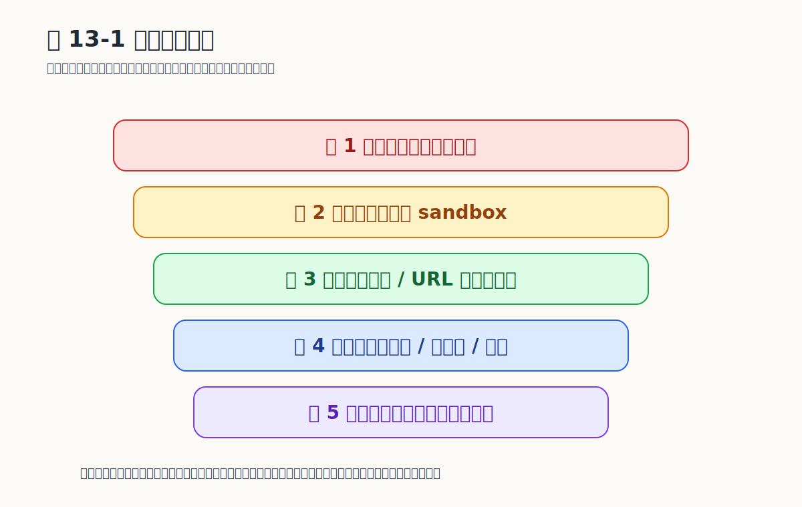

# Chapter 13 安全体系

## 威胁模型

Agent 一旦能执行命令、读写文件、发消息、接插件，就是带有真实操作权的运行时系统。MicroClaw v0.1.57 的安全体系从代码层面拆成六层防线，每一层都有具体的源码挂钩，没有一项是停留在配置文档里的口号。

| 资产类别 | 包含内容 | 主要风险 |
|---------|---------|---------|
| 宿主机执行环境 | 工作目录、文件系统、shell 调用 | 越权后果最严重 |
| 运行时状态 | `microclaw.db`：会话、记忆、调度、API key 哈希、`audit_logs` | 高价值攻击目标 |
| 凭据与配置 | LLM API key、渠道 token、MCP header | 配置误泄比代码 bug 更快造成事故 |
| 跨 chat 边界 | 不同 chat 之间的状态隔离 | 由 `ChatTurnQueue` 与 `working_dir_isolation` 共同保障 |
| 扩展生态入口 | MCP server、Skill、Plugin、Hook、ClawHub | 供应链风险 |

## 六层防线总览

```
请求进入
   │
   ▼
┌──────────────────────────────────────────────┐
│ 第一层：审批门 ToolRisk::High + 显式同意     │
├──────────────────────────────────────────────┤
│ 第二层：执行策略 Hook 三事件 + HookOutcome   │
├──────────────────────────────────────────────┤
│ 第三层：Sandbox SandboxRouter / SandboxMode  │
├──────────────────────────────────────────────┤
│ 第四层：路径保护 working_dir_isolation       │
├──────────────────────────────────────────────┤
│ 第五层：网络校验 web_fetch SSRF 预检         │
├──────────────────────────────────────────────┤
│ 第六层：控制面鉴权 Argon2 + API key + RBAC   │
└──────────────────────────────────────────────┘
```

## 第一层：审批门

工具按危险度分三级：`ToolRisk::Low`、`ToolRisk::Medium`、`ToolRisk::High`（在 `crates/microclaw-tools/src/runtime.rs` 中由 `tool_risk(name)` 决定）。`bash` 等可能在宿主机上留下不可逆痕迹的工具落入 `High`；`write_memory`、`structured_memory_update`、`pause_scheduled_task`、`cancel_scheduled_task` 这类会改长期状态但仍可控的操作落入 `Medium`；其余只读或纯计算工具默认 `Low`。审批门只挂在 `High` 上：`Medium` 与 `Low` 默认放行，`Medium` 通过 Hook 可加额外校验。

`ToolRisk::High` 工具不会因为模型「想用」就直接执行，必须由真实用户在 chat 中给出**显式同意**。判断函数 `is_explicit_user_approval()` 在 `src/agent_engine.rs` 里同时识别中英文确认词与否定词：

```rust
fn is_explicit_user_approval(text: &str) -> bool {
    let normalized = strip_xml_like_tags(text).trim().to_ascii_lowercase();
    if normalized.is_empty() {
        return false;
    }
    const DENY: &[&str] = &[
        "don't", "do not", "deny", "reject", "cancel", "stop",
        "不同意", "不批准", "不要", "取消", "停止",
    ];
    if DENY.iter().any(|m| normalized.contains(m)) {
        return false;
    }
    const APPROVE: &[&str] = &[
        "approve", "approved", "go ahead", "proceed", "run it",
        "确认", "批准", "同意", "继续", "可以执行", "执行吧",
    ];
    APPROVE.iter().any(|m| normalized.contains(m))
}
```

设计要点：默认拒绝、显式词触发；否定优先于肯定（同一句中先看到「不要」就直接 false）；中英文混写也能识别。

## 第二层：执行策略与 Hook 三事件

`HookManager` 在 agent run 的三个固定切点触发外部脚本：

```rust
pub enum HookEvent {
    BeforeLLMCall,
    BeforeToolCall,
    AfterToolCall,
}

pub enum HookOutcome {
    Allow { patches: Vec<serde_json::Value> },
    Block { reason: String },
}
```

每个 hook 是 `hooks/` 目录下的一个可执行文件，按 `priority` 排序，从 stdin 接 JSON、从 stdout 返回 `{"action": "allow"|"block", "reason": "...", "patch": {...}}`。`run` 方法收集所有 patches，遇到第一个 block 立即短路：

```rust
pub async fn run(&self, event: HookEvent, payload: Value) -> Result<HookOutcome> {
    let mut patches = Vec::new();
    for hook in self.matched(event).iter() {
        match self.invoke(hook, &payload).await? {
            HookResp::Block { reason } => return Ok(HookOutcome::Block { reason }),
            HookResp::Allow { patch } => {
                if let Some(p) = patch { patches.push(p); }
            }
        }
    }
    Ok(HookOutcome::Allow { patches })
}
```

效果：可以在 `BeforeToolCall` 里判断 `bash` 命令字符串再决定放行或拦截，也可以在 `AfterToolCall` 里把工具输出截断、加密或脱敏。`max_input_bytes` 与 `max_output_bytes` 限制 hook 可见的载荷大小，防 hook 本身成为 DoS 入口。

## 第三层：Sandbox 与执行策略

Sandbox 由两部分组成。

`SandboxRouter`（`crates/microclaw-tools/src/sandbox.rs`）按工具名和当前 `SandboxMode` 决定：在宿主机执行还是塞进容器执行。`SandboxMode` 共三档：`Off`（开发态）、`Shared`（一个共享容器）、`All`（每 chat 独立容器，多用户场景关键）。

Plugin 这一层叠加 `PluginExecutionPolicy`（`src/plugins.rs`）：

```rust
pub enum PluginExecutionPolicy {
    HostOnly,     // 始终在宿主机执行
    SandboxOnly,  // 必须在 sandbox（要求 SandboxMode::All 且 runtime 可用）
    Dual,         // 由 SandboxRouter 决定
}

impl PluginExecutionPolicy {
    fn is_allowed(self, mode: SandboxMode, runtime_ok: bool) -> bool {
        match self {
            Self::HostOnly => true,
            Self::Dual => true,
            Self::SandboxOnly => mode == SandboxMode::All && runtime_ok,
        }
    }
}
```

如果 plugin 声明自己是 `SandboxOnly` 但当前 `SandboxMode::Off`，`is_allowed` 直接返回 false——加载阶段就拒绝，不会等到执行时才出错。

## 第四层：路径保护

`working_dir_isolation` 配置项（`config.rs`）有两个值：`Shared` 与 `Chat`。默认 `Chat`：每个 `(channel, chat_id)` 在 `<data_dir>/workspaces/<channel>/<chat_id>/` 下有独立工作目录，不同 chat 的文件操作互不可见。

文件类工具（`read_file`、`write_file`、`edit_file`、`glob`、`grep`）在执行前都会经过 `ToolAuthContext` 校验，把绝对路径规范化后比对当前 chat 的工作目录前缀；越界路径不会被拒之门外的 sandbox 顶住，而是在工具调度层就直接 `Err`。`bash` 因为可以拼出任意路径，专门走 `tool_risk == High` 的审批门加 `Dual` sandbox 双闸。

## 第五层：网络抓取的 SSRF 预检

`web_fetch` 工具（`crates/microclaw-tools/src/web_fetch.rs`）默认 `block_private_ips=true`，并把 hostname/IP 提交给 `url_safety::check_url_private_ip` 检查：

| 类别 | 拦截对象 |
|------|---------|
| Loopback | `127.0.0.0/8`、`::1` |
| Link-local | `169.254.0.0/16`（覆盖 AWS/Azure/GCP IMDSv1 `169.254.169.254`） |
| Private | `10.0.0.0/8`、`172.16.0.0/12`、`192.168.0.0/16` |
| CGNAT | `100.64.0.0/10` |
| IPv6 ULA | `fc00::/7` |
| Cloud metadata | `metadata.google.internal`、`metadata.goog`、`metadata` |

```rust
if config.block_private_ips {
    let allowlisted = config.allowlist_hosts.iter()
        .any(|rule| host_matches_rule(&host, rule));
    if !allowlisted {
        url_safety::check_url_private_ip(&parsed)?;
    }
}
```

重要细节：重定向也要重新跑一遍校验。`fetch_url_with_timeout_and_validation` 在每次跳转时调用 `resolve_and_validate_redirect_target`，防止「初始 URL 公网、Location 头跳到内网」的绕过。

## 第六层：控制面鉴权

Web 控制面（`src/web/auth.rs`）四件套：

**密码用 Argon2**。`make_password_hash` 用 UUIDv4 生成 salt，存为 PHC 字符串。旧的 `v1$salt$hash` 老格式登录时自动升级。

**Session**：登录成功生成 UUID v4 token，写 `mc_session`（HttpOnly + Secure + SameSite）cookie，服务端在 `auth_sessions` 表保存 token、label、`expires_at`。退出登录走 `revoke_auth_session`，清 cookie。

**API key + RBAC**：`mk_<uuid>` 一次性返还给用户，DB 里只存 SHA-256 哈希加 prefix。Scope 共四种：`operator.read` / `operator.write` / `operator.admin` / `operator.approvals`，由 `require_scope` 中间件校验：

```rust
const VALID_SCOPES: &[&str] = &[
    "operator.read",
    "operator.write",
    "operator.admin",
    "operator.approvals",
];
```

撤销标 `revoked_at`，轮换是「原子创建新 key + 撤销旧 key」。

**audit_logs**：所有写操作都过 `audit_log()`，落 `(kind, actor, action, target, status, detail, created_at)` 六列。schema v25+ 在 `db.rs` 内置迁移，启动时 `apply_schema_migrations` 自动升版。

## 扩展供应链治理

光靠运行期防线不够，扩展加载阶段也要有抓手。

**MCP server**（`src/mcp.rs`）：每个 server 自带 `circuit_breaker_failure_threshold` + `circuit_breaker_cooldown_secs` + `rate_limit_per_minute`。`McpServer` 在调用前先过 `FixedWindowRateLimiter`，再过 `CircuitBreakerState`：连续失败超阈值则进入 open 状态，冷却结束前所有请求快速失败、不消耗下游资源。

**Skill** 自动归档：`skill_activation_logs` 表（schema v22）按 `(skill_name, chat_id, activated_at)` 落每次激活，长期不用的 skill 在 `microclaw doctor` 里被标 `WARN`，方便定期清理。

**Hook** 与 **Plugin**：通过 hooks 目录或配置加载，hook 受 `enabled`、超时、stdin/stdout 大小限制；plugin 受 `PluginExecutionPolicy` 与 `allowed_channels` 双闸。

```{=typst}
#pagebreak(weak: true)
```

## 容易走错的地方

**把安全完全等同于 sandbox**：没有审批门、路径保护、控制面鉴权，容器化只是把单层防线挪了个位置。

**把 hook 当成可信代码**：hook 是用户脚本，要给它输入大小、输出大小、超时、stderr 收集四个限制，否则它会反过来拖垮 runtime。

**API key 明文存储**：DB 泄露=直接交出控制权。`mk_xxx` 只在创建那一刻返回给用户，DB 只存 SHA-256，是不可降级的最低线。

**SSRF 校验只看初始 URL**：忽略 30x 重定向是经典绕过点。`web_fetch` 在每跳都重跑一遍 `validate_web_fetch_url`。

## 证据来源（v0.1.57）

- 源码：`src/agent_engine.rs`（is_explicit_user_approval）、`src/hooks.rs`、`src/mcp.rs`、`src/plugins.rs`、`src/web/auth.rs`、`src/run_control.rs`、`src/chat_turn_queue.rs`
- crate：`crates/microclaw-tools/src/runtime.rs`（ToolRisk）、`crates/microclaw-tools/src/sandbox.rs`、`crates/microclaw-tools/src/web_fetch.rs`、`crates/microclaw-tools/src/url_safety.rs`
- 表结构：`crates/microclaw-storage/src/db.rs`（`audit_logs`、`auth_sessions`、`api_keys`、`skill_activation_logs`，`SCHEMA_VERSION_CURRENT = 25`）

## 图表清单

### 图 13-1：六层安全防线


